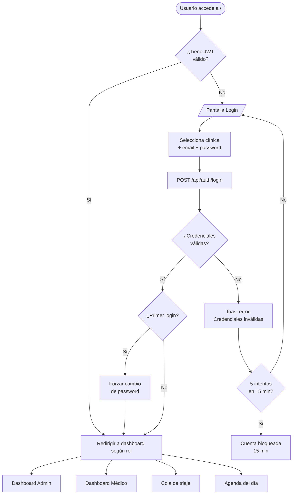
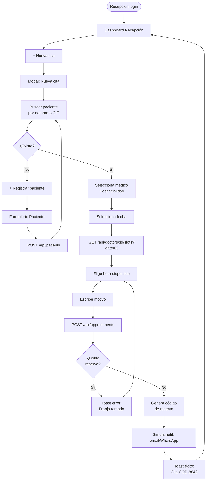
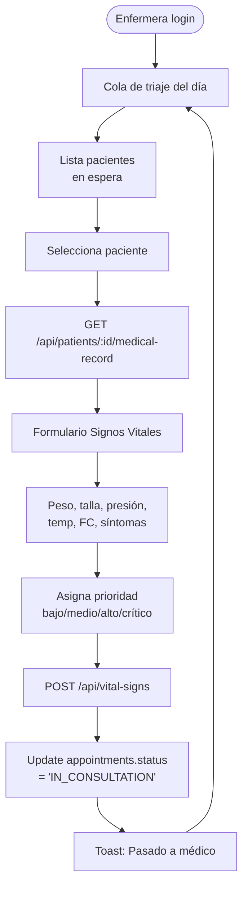
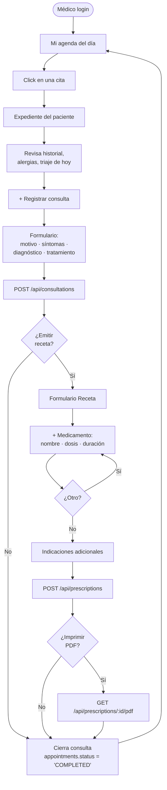
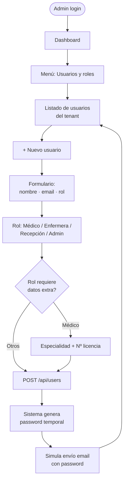
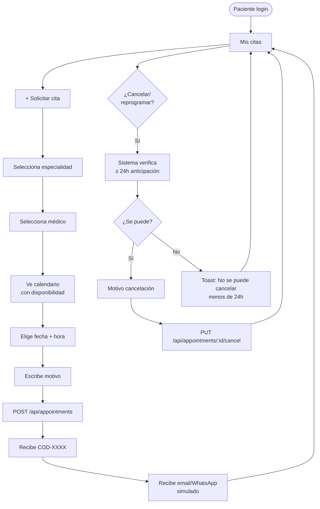
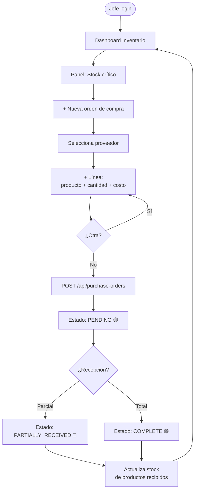
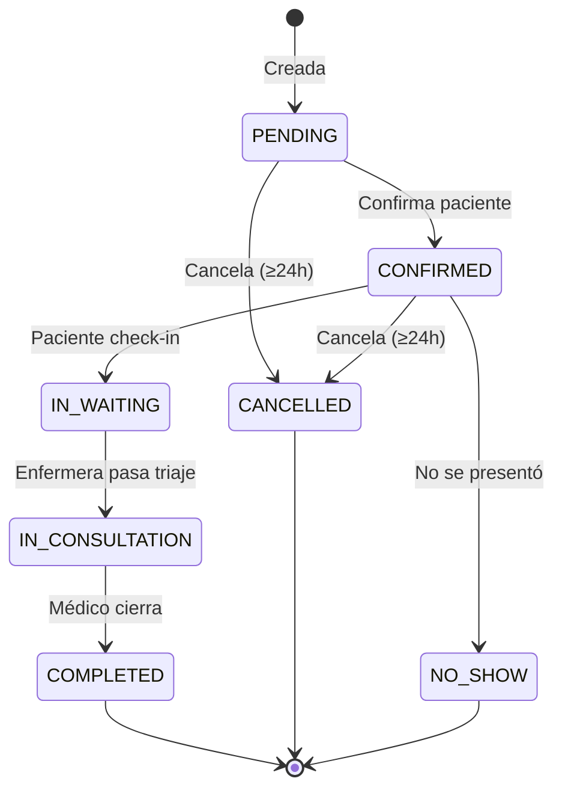
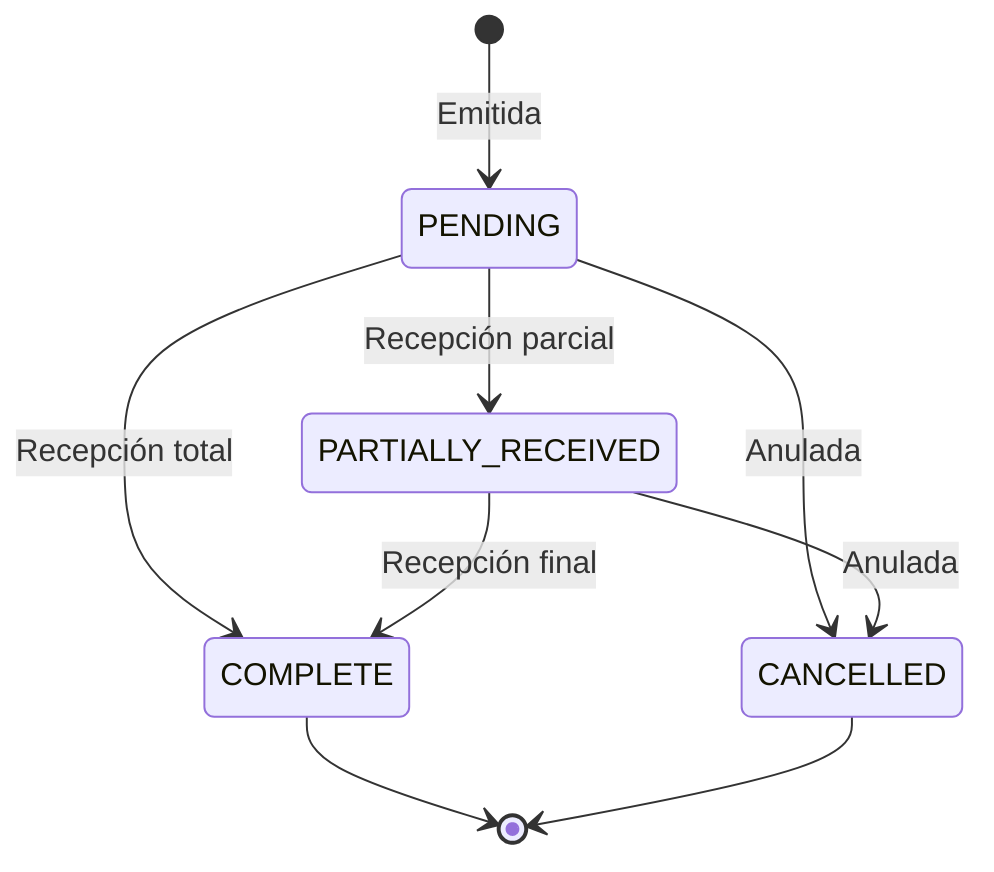

# APPFLOW — MediSuite

> Flujos de navegación de la aplicación por rol y por HU.
> Versión: 1.0 · Fecha: 26/07/2026 · Owner: Zair Diaz + William Melgar (Frontend)

Este documento describe las rutas de usuario dentro de MediSuite. Cada diagrama Mermaid muestra la secuencia de pantallas, decisiones y estados. Complementa a [DISENO_UI_UX.md](DISENO_UI_UX.md) (cómo se ven las pantallas) y a [PRD.md](PRD.md) (HU que motivan el flujo).

---

## 1. Flujo transversal — Autenticación (HU-007)



Notas de implementación:
- JWT devuelto en cuerpo (`accessToken`) + refresh token en cookie HttpOnly.
- `TenantContext` se hidrata desde el claim `tenant_id` del JWT en el filtro de Spring.
- Fallo tras 5 intentos: contador en Redis (fase futura) o tabla `login_attempts` (MVP).

---

## 2. Flujo Recepcionista — Agendar cita (HU-003 + HU-005)



Reglas de negocio:
- Índice único parcial en `appointments(doctor_id, appointment_date, appointment_time) WHERE status IN ('PENDING','CONFIRMED')` impide doble reserva a nivel BD.
- Código de reserva: `COD-` + 4 dígitos aleatorios únicos por tenant.
- Cancelar/reprogramar solo con ≥ 24 h de anticipación (validación en service).

---

## 3. Flujo Enfermera — Triaje (HU-004)



Notas:
- Los signos vitales quedan en `vital_signs`, asociados a `medical_record_id`.
- El médico ve el triaje del día en su agenda antes de abrir el expediente.
- Prioridad "Crítica" dispara alerta visual (badge rojo pulsante) en la agenda del médico.

---

## 4. Flujo Médico — Consulta + Receta (HU-002 + HU-009)



Reglas:
- Un mismo médico no puede modificar consulta después de 24 h de emitida (auditoría clínica).
- Toda emisión de receta queda en `prescriptions` con `emitted_at`, `doctor_id`, `patient_id`, líneas en `prescription_items`.

---

## 5. Flujo Administrador — Alta de usuario (HU-008)



Notas:
- Password temporal se envía por email (o log en MVP) y **debe** cambiarse en el primer login (ver flujo §1).
- El rol determina permisos vía Spring Security (`@PreAuthorize("hasRole('DOCTOR')")`).

---

## 6. Flujo Paciente — Solicitar cita online (HU-003 rol paciente)



---

## 7. Flujo Jefe de almacén — Órdenes de compra (HU-011)



---

## 8. Diagrama de estados — Cita



## 9. Diagrama de estados — Orden de compra



---

## 10. Estados globales de UI

| Estado | Origen | Comportamiento |
|---|---|---|
| **Loading** | HTTP en vuelo | Skeleton en cards, spinner en botones. |
| **Empty** | Respuesta con array vacío | Ilustración + copy + CTA principal. |
| **Error 4xx** | Validación backend | Toast rojo + mensaje del backend en `messages_XX.properties`. |
| **Error 5xx** | Excepción no controlada | Toast rojo genérico + botón "Reportar". Log en backend con `trace_id`. |
| **Session expired (401)** | JWT vencido | Interceptor de Axios/fetch → intenta refresh token → si falla, redirige a login con toast. |
| **Sin permiso (403)** | Rol insuficiente | Toast: "No tienes permiso para esta acción". No redirige. |
| **Offline** | Sin red | Banner superior amarillo: "Sin conexión — algunos cambios no se guardarán". |

---

## 11. Rutas frontend (React Router)

```
/                          → Redirige según sesión
/login                     → Pantalla de login
/dashboard                 → Dashboard según rol
/patients                  → Listado pacientes
/patients/new              → Alta paciente
/patients/:id              → Expediente paciente
/patients/:id/vital-signs  → Triaje
/appointments              → Agenda (según rol)
/appointments/new          → Nueva cita
/appointments/:id          → Detalle cita
/prescriptions/new         → Emitir receta
/prescriptions/:id         → Detalle receta
/users                     → Gestión de usuarios (admin)
/users/new                 → Nuevo usuario
/reports                   → Reportes (admin)
/inventory                 → Inventario (jefe almacén)
/inventory/purchase-orders → Órdenes de compra
/settings                  → Configuración
/audit                     → Auditoría (admin)
/profile                   → Perfil del usuario logueado
/403                       → Sin permiso
/404                       → No encontrado
```

---

## 12. Referencias

- [DISENO_UI_UX.md](DISENO_UI_UX.md) — cómo se ven las pantallas mencionadas.
- [PRD.md](PRD.md) — HU que motivan cada flujo.
- [ESQUEMA_BACKEND.md](ESQUEMA_BACKEND.md) — endpoints REST invocados en cada paso.
