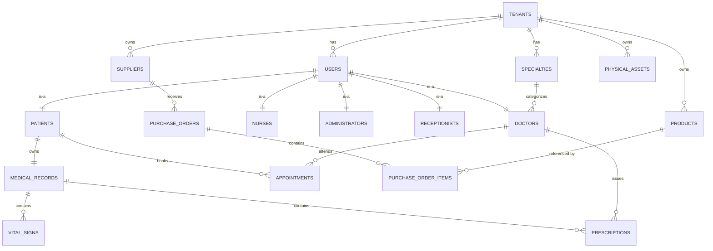

# ESQUEMA_BACKEND — MediSuite

> Arquitectura de capas · esquema de BD · endpoints REST.
> Versión: 1.0 · Fecha: 26/07/2026 · Owner: Carlos Ventura (Architect) + Bayron Orellana (Backend)

Este documento consolida la vista técnica del backend: cómo están organizadas las capas, qué entidades viven en cada tabla, y qué endpoints REST expone cada módulo. Es la fuente de verdad para el equipo backend en cualquier decisión de estructura.

- **Esquema SQL ejecutable:** [database/schema.sql](../database/schema.sql) (17 tablas PostgreSQL 16).
- **Seed de datos demo:** [database/seed.sql](../database/seed.sql).
- **Descripción tabla por tabla:** [docs/fases/ESQUEMA_BASE_DATOS.md](fases/ESQUEMA_BASE_DATOS.md).
- **Guía de código Java existente:** [docs/fases/GUIA_DESARROLLO_BACKEND.md](fases/GUIA_DESARROLLO_BACKEND.md).

---

## 1. Arquitectura de capas

```
┌───────────────────────────────────────────────────────────┐
│  Controller  (@RestController)                            │
│  - Recibe HTTP, valida DTO, delega en Service             │
│  - Maneja códigos de estado y headers                     │
└──────────────────┬────────────────────────────────────────┘
                   ▼
┌───────────────────────────────────────────────────────────┐
│  DTO  (records)                                           │
│  - Contrato de entrada/salida REST                        │
│  - Nunca expone Entity al cliente                         │
└──────────────────┬────────────────────────────────────────┘
                   ▼
┌───────────────────────────────────────────────────────────┐
│  Service  (@Service)                                      │
│  - Lógica de negocio, transacciones (@Transactional)      │
│  - Orquesta múltiples repos, valida reglas                │
└──────────────────┬────────────────────────────────────────┘
                   ▼
┌───────────────────────────────────────────────────────────┐
│  Repository  (@Repository, Spring Data JPA)               │
│  - Query methods, JPQL, @Query nativa cuando necesaria    │
│  - Filtra por tenant_id automáticamente                   │
└──────────────────┬────────────────────────────────────────┘
                   ▼
┌───────────────────────────────────────────────────────────┐
│  Entity  (@Entity + JPA)                                  │
│  - Mapeo 1-a-1 con tabla, sin lógica de negocio           │
└──────────────────┬────────────────────────────────────────┘
                   ▼
                PostgreSQL 16 (Neon)
```

**Reglas duras:**

- Controller **nunca** habla con Repository. Siempre pasa por Service.
- Entity **nunca** sale del backend hacia el cliente. Convertir a DTO en Service.
- Toda mutación de datos vive en un método `@Transactional` del Service.
- Toda query de negocio filtra por `tenant_id` (ver §4 Multi-tenancy).

---

## 2. Estructura de paquetes Java

```
com.sv.grupo.hospital.citas/
├── HospitalCitasApplication.java     ← @SpringBootApplication
├── config/
│   ├── SecurityConfig.java           ← Spring Security + JWT filter chain
│   ├── LocaleConfig.java             ← MessageSource i18n
│   ├── OpenApiConfig.java            ← Swagger/OpenAPI
│   └── JpaAuditingConfig.java        ← @EnableJpaAuditing
├── model/
│   ├── tenant/
│   │   └── Tenant.java
│   ├── users/
│   │   ├── User.java
│   │   ├── Patient.java
│   │   ├── Doctor.java
│   │   ├── Nurse.java
│   │   ├── Administrator.java
│   │   └── Receptionist.java
│   ├── clinical/
│   │   ├── Specialty.java
│   │   ├── Appointment.java
│   │   ├── MedicalRecord.java
│   │   ├── VitalSign.java
│   │   └── Prescription.java
│   └── inventory/
│       ├── Product.java
│       ├── Supplier.java
│       ├── PurchaseOrder.java
│       ├── PurchaseOrderItem.java
│       └── PhysicalAsset.java
├── dao/                              ← Repositorios (Spring Data JPA)
│   ├── TenantRepository.java
│   ├── UserRepository.java
│   ├── PatientRepository.java
│   ├── DoctorRepository.java
│   ├── AppointmentRepository.java
│   └── ...
├── service/
│   ├── AuthService.java
│   ├── PatientService.java
│   ├── AppointmentService.java
│   └── ...
├── controller/api/
│   ├── AuthController.java
│   ├── PatientController.java
│   ├── AppointmentController.java
│   └── ...
├── dto/
│   ├── auth/
│   │   ├── LoginRequest.java   (record)
│   │   └── LoginResponse.java  (record)
│   ├── patient/
│   │   ├── PatientRequest.java
│   │   └── PatientResponse.java
│   └── ...
├── security/
│   ├── JwtTokenProvider.java
│   ├── JwtAuthenticationFilter.java
│   ├── TenantContext.java            ← ThreadLocal<Long>
│   └── TenantFilter.java
├── util/
│   ├── ReservationCodeGenerator.java
│   └── PasswordGenerator.java
└── exception/
    ├── ResourceNotFoundException.java
    ├── BusinessException.java
    └── GlobalExceptionHandler.java   ← @RestControllerAdvice
```

**Convención:** una clase por archivo; nombres en inglés; ver [ESTANDARES_CODIGO.md](ESTANDARES_CODIGO.md).

---

## 3. Diagrama entidad-relación (17 tablas)



### 3.1. Resumen por módulo

| Módulo | Tablas |
|---|---|
| **Multi-tenant** | `tenants` |
| **Usuarios** | `users`, `patients`, `doctors`, `nurses`, `administrators`, `receptionists`, `specialties` |
| **Clínico** | `appointments`, `medical_records`, `vital_signs`, `prescriptions` |
| **Inventario** | `products`, `suppliers`, `purchase_orders`, `purchase_order_items`, `physical_assets` |

**Total: 17 tablas.** El SQL completo está en [database/schema.sql](../database/schema.sql).

### 3.2. Decisiones de diseño clave

| Decisión | Razón |
|---|---|
| Columna `tenant_id` en toda tabla de negocio | Aislamiento multi-tenant sin schemas separados (ver [TRD § ADR-01](TRD.md#adr-01--multi-tenancy-por-columna-no-por-schema)). |
| `UNIQUE (tenant_id, X)` para claves de negocio | Evita colisión entre tenants con mismos valores. |
| Índice único parcial en `appointments` | Impide doble-reserva a nivel BD: `WHERE status <> 'CANCELLED'`. |
| Tabla `specialties` normalizada (v2) | Antes era texto libre en `doctors.specialty`; ahora FK evita "Pediatría" vs "pediatria". |
| Trigger `set_updated_at()` en todas | Auditoría automática. |
| Contraseña en `users.password_hash` (VARCHAR 255) | BCrypt cost=12. Nunca en claro. |
| `failed_login_attempts` + `locked_until` en `users` | Bloqueo automático tras 5 fallos en 15 min. |
| Rol como `VARCHAR CHECK` (no FK a tabla) | Los roles del sistema son fijos y pocos (5); simplifica queries. |
| Timestamps con timezone (`TIMESTAMPTZ`) | El SaaS opera en múltiples zonas horarias. |

---

## 4. Multi-tenancy — implementación

### 4.1. Flujo por request

```
1. Request llega con Authorization: Bearer <JWT>
2. JwtAuthenticationFilter valida firma, expiración
3. Lee claim "tenant_id" y "role" del JWT
4. TenantFilter guarda tenant_id en TenantContext (ThreadLocal)
5. Cualquier consulta al Repository invoca:
     em.unwrap(Session.class)
       .enableFilter("tenantFilter")
       .setParameter("tenantId", TenantContext.get());
6. Al final del request, TenantFilter limpia ThreadLocal (evita leak).
```

### 4.2. Filtro Hibernate global

```java
@FilterDef(name = "tenantFilter",
           parameters = @ParamDef(name = "tenantId", type = Long.class))
@Filter(name = "tenantFilter", condition = "tenant_id = :tenantId")
@MappedSuperclass
public abstract class TenantEntity {
    @Column(name = "tenant_id", nullable = false)
    private Long tenantId;
}
```

Todas las entidades de negocio extienden de `TenantEntity`. El super-admin puede desactivar el filtro (`session.disableFilter("tenantFilter")`) para consultas cross-tenant.

---

## 5. Endpoints REST — mapa por módulo

### 5.1. Autenticación (`/api/auth`)

| Método | Ruta | Descripción | Rol requerido |
|---|---|---|---|
| `POST` | `/api/auth/login` | Login con email + password + tenant_slug | Público |
| `POST` | `/api/auth/refresh` | Renovar access token | Refresh cookie |
| `POST` | `/api/auth/logout` | Invalidar sesión | Autenticado |
| `POST` | `/api/auth/change-password` | Cambiar password (obligatorio primer login) | Autenticado |

### 5.2. Usuarios (`/api/users`)

| Método | Ruta | Descripción | Rol requerido |
|---|---|---|---|
| `GET` | `/api/users` | Listar usuarios del tenant (paginado) | ADMIN |
| `POST` | `/api/users` | Crear usuario (genera password temporal) | ADMIN |
| `GET` | `/api/users/{id}` | Detalle de usuario | ADMIN / mismo usuario |
| `PUT` | `/api/users/{id}` | Actualizar datos | ADMIN / mismo usuario |
| `DELETE` | `/api/users/{id}` | Desactivar (soft delete) | ADMIN |
| `GET` | `/api/users/me` | Perfil del usuario logueado | Autenticado |

### 5.3. Pacientes (`/api/patients`)

| Método | Ruta | Descripción | Rol requerido |
|---|---|---|---|
| `GET` | `/api/patients?search=X&page=0&size=20` | Buscar por nombre o CIF | RECEP / NURSE / DOCTOR / ADMIN |
| `POST` | `/api/patients` | Alta de paciente | RECEP / NURSE / ADMIN |
| `GET` | `/api/patients/{id}` | Detalle | Todos internos |
| `PUT` | `/api/patients/{id}` | Actualizar datos administrativos | RECEP / ADMIN |
| `GET` | `/api/patients/{id}/medical-record` | Expediente completo | DOCTOR / NURSE |
| `GET` | `/api/patients/{id}/vital-signs` | Historial de signos | DOCTOR / NURSE |
| `GET` | `/api/patients/{id}/prescriptions` | Historial de recetas | DOCTOR / mismo paciente |

### 5.4. Médicos y especialidades

| Método | Ruta | Descripción | Rol requerido |
|---|---|---|---|
| `GET` | `/api/doctors` | Listar médicos del tenant | Autenticado |
| `GET` | `/api/doctors/{id}/slots?date=YYYY-MM-DD` | Horarios disponibles del día | RECEP / PATIENT |
| `GET` | `/api/doctors/{id}/agenda?date=YYYY-MM-DD` | Agenda propia del médico | DOCTOR (mismo id) / ADMIN |
| `GET` | `/api/specialties` | Listar especialidades | Autenticado |
| `POST` | `/api/specialties` | Crear especialidad | ADMIN |

### 5.5. Citas (`/api/appointments`)

| Método | Ruta | Descripción | Rol requerido |
|---|---|---|---|
| `POST` | `/api/appointments` | Crear cita (retorna reservation_code) | RECEP / PATIENT |
| `GET` | `/api/appointments/{id}` | Detalle | Involucrados |
| `PUT` | `/api/appointments/{id}` | Reprogramar (≥ 24 h de anticipación) | RECEP / PATIENT / ADMIN |
| `POST` | `/api/appointments/{id}/cancel` | Cancelar (≥ 24 h) | RECEP / PATIENT / ADMIN |
| `POST` | `/api/appointments/{id}/check-in` | Paciente check-in (→ WAITING) | RECEP |
| `POST` | `/api/appointments/{id}/complete` | Cerrar cita (→ COMPLETED) | DOCTOR |

### 5.6. Triaje (`/api/vital-signs`)

| Método | Ruta | Descripción | Rol requerido |
|---|---|---|---|
| `POST` | `/api/vital-signs` | Registrar signos vitales | NURSE |
| `GET` | `/api/vital-signs/{id}` | Detalle | DOCTOR / NURSE |

### 5.7. Recetas (`/api/prescriptions`)

| Método | Ruta | Descripción | Rol requerido |
|---|---|---|---|
| `POST` | `/api/prescriptions` | Emitir receta | DOCTOR |
| `GET` | `/api/prescriptions/{id}` | Detalle | Involucrados |
| `GET` | `/api/prescriptions/{id}/pdf` | Descargar PDF | Involucrados |

### 5.8. Reportes (`/api/reports`)

| Método | Ruta | Descripción | Rol requerido |
|---|---|---|---|
| `GET` | `/api/reports/occupancy?from=X&to=Y` | Ocupación por médico | ADMIN |
| `GET` | `/api/reports/appointments-by-status?from=X&to=Y` | Distribución de estados | ADMIN |
| `GET` | `/api/reports/patients-registered?from=X&to=Y` | Altas de pacientes | ADMIN |

### 5.9. Inventario y compras (`/api/inventory`, `/api/purchase-orders`) — extensión

| Método | Ruta | Descripción | Rol requerido |
|---|---|---|---|
| `GET` | `/api/inventory/products` | Listar productos | STOCK_MANAGER |
| `POST` | `/api/inventory/products` | Crear producto | STOCK_MANAGER |
| `POST` | `/api/purchase-orders` | Crear orden de compra | STOCK_MANAGER |
| `POST` | `/api/purchase-orders/{id}/receive` | Recepción (total o parcial) | STOCK_MANAGER |

---

## 6. Contratos DTO (ejemplo Auth)

```java
// dto/auth/LoginRequest.java
public record LoginRequest(
    @NotBlank String tenantSlug,
    @Email    String email,
    @NotBlank String password
) {}

// dto/auth/LoginResponse.java
public record LoginResponse(
    String accessToken,
    String tokenType,     // "Bearer"
    long   expiresIn,     // segundos
    UserInfo user
) {
    public record UserInfo(Long id, String fullName, String role, Long tenantId) {}
}
```

Reglas:
- DTOs son **records** (inmutables). No usar clases con setters.
- Validación con Jakarta Bean Validation (`@NotBlank`, `@Email`, `@Size`).
- Errores de validación → `GlobalExceptionHandler` responde 400 con lista de campos inválidos.

---

## 7. Códigos HTTP estándar

| Situación | Código |
|---|---|
| Recurso creado | `201 Created` (con `Location` header) |
| Recurso obtenido/actualizado | `200 OK` |
| Sin contenido (delete) | `204 No Content` |
| Validación falla | `400 Bad Request` |
| No autenticado | `401 Unauthorized` |
| Sin permiso | `403 Forbidden` |
| No encontrado | `404 Not Found` |
| Conflicto (doble reserva, email duplicado) | `409 Conflict` |
| Regla de negocio | `422 Unprocessable Entity` |
| Error interno | `500 Internal Server Error` |

---

## 8. Referencias

- [database/schema.sql](../database/schema.sql) — SQL ejecutable.
- [docs/fases/ESQUEMA_BASE_DATOS.md](fases/ESQUEMA_BASE_DATOS.md) — descripción tabla a tabla.
- [docs/fases/GUIA_DESARROLLO_BACKEND.md](fases/GUIA_DESARROLLO_BACKEND.md) — código Java existente por módulo.
- [TRD.md](TRD.md) — decisiones técnicas.
- [APPFLOW.md](APPFLOW.md) — qué endpoint invoca cada pantalla.
- [ESTANDARES_CODIGO.md](ESTANDARES_CODIGO.md) — convenciones.
