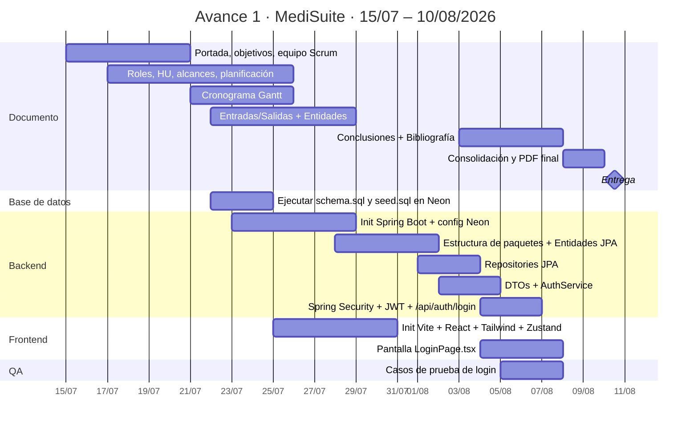

# PLAN DE EJECUCIÓN — AVANCE 1 (MediSuite)

> Documento operativo para el equipo. **Cada persona lee su tarea, copia el código/comandos y ejecuta**. Sin decisiones adicionales.
>
> Versión: 1.0 · Fecha: 26/07/2026 · Owner: Héctor López (PM) + Alejandro Vigil (SM)
>
> **Ventana:** 15/07/2026 → 07/08/2026 (24 días naturales) · Margen 08–09/08 · **Entrega: 10/08/2026**.
>
> **Nota:** hoy es 26/07. Varias tareas del Bloque A (documento) están planificadas con fechas ya vencidas (15–25/07) — se dejan así de forma intencional para reflejar el arranque real del proyecto y para que Planner las muestre como "atrasadas" hasta que se completen y muevan al bucket "Hecho".

Este documento cubre el 100% de los **14 puntos oficiales** del documento `AVANCE1_DOCUMENTO_ENTREGAR.md`. La sección "¿Por qué Scrum?" es nota del ingeniero y **no genera tareas**.

---

## Índice rápido

- [Cómo usar este documento](#cómo-usar-este-documento)
- [Convención Git (leer antes de tocar código)](#convención-git-leer-antes-de-tocar-código)
- [Bloque A · Documento del entregable (puntos 1–11, 13, 14)](#bloque-a--documento-del-entregable)
  - [Tarea 1.1 — Portada individual](#tarea-11--portada-individual)
  - [Tarea 2.1 — Objetivo General](#tarea-21--objetivo-general)
  - [Tarea 3.1 — Objetivo Específico del Avance 1](#tarea-31--objetivo-específico-del-avance-1)
  - [Tarea 4.1 — Distribución del Equipo Scrum](#tarea-41--distribución-del-equipo-scrum)
  - [Tarea 5.1 — Roles y funciones del sistema](#tarea-51--roles-y-funciones-del-sistema)
  - [Tarea 6.1 — Historias de Usuario](#tarea-61--historias-de-usuario)
  - [Tarea 7.1 — Alcances y límites](#tarea-71--alcances-y-límites)
  - [Tarea 8.1 — Planificación (tabla)](#tarea-81--planificación-tabla)
  - [Tarea 9.1 — Cronograma Gantt](#tarea-91--cronograma-gantt)
  - [Tarea 10.1 — Entradas/Salidas por HU](#tarea-101--entradassalidas-por-hu)
  - [Tarea 11.1 — Declaración de Entidades](#tarea-111--declaración-de-entidades)
  - [Tarea 13.1 — Conclusiones (individuales)](#tarea-131--conclusiones-individuales)
  - [Tarea 14.1 — Bibliografía APA](#tarea-141--bibliografía-apa)
- [Bloque B · Proyecto base con código (punto 12)](#bloque-b--proyecto-base-con-código)
  - [Tarea 12.1 — Ejecutar `schema.sql` en Neon](#tarea-121--ejecutar-schemasql-en-neon)
  - [Tarea 12.2 — Inicializar proyecto Spring Boot](#tarea-122--inicializar-proyecto-spring-boot)
  - [Tarea 12.3 — Configurar conexión a Neon (application.yml)](#tarea-123--configurar-conexión-a-neon-applicationyml)
  - [Tarea 12.4 — Estructura de paquetes + Entidades](#tarea-124--estructura-de-paquetes--entidades)
  - [Tarea 12.5 — Repositories JPA](#tarea-125--repositories-jpa)
  - [Tarea 12.6 — DTOs + Services de Auth](#tarea-126--dtos--services-de-auth)
  - [Tarea 12.7 — Spring Security + JWT + Endpoint /api/auth/login](#tarea-127--spring-security--jwt--endpoint-apiauthlogin)
  - [Tarea 12.8 — Inicializar frontend React + Vite + Tailwind + Zustand](#tarea-128--inicializar-frontend-react--vite--tailwind--zustand)
  - [Tarea 12.9 — Pantalla LoginPage.tsx](#tarea-129--pantalla-loginpagetsx)
  - [Tarea 12.10 — Casos de prueba QA](#tarea-1210--casos-de-prueba-qa)
- [Bloque C · Carga masiva a Planner](#bloque-c--carga-masiva-a-planner)
- [Cronograma resumen (tabla para Planner)](#cronograma-resumen-tabla-para-planner)
- [Checklist final de cobertura (14 puntos)](#checklist-final-de-cobertura-14-puntos)

---

## Cómo usar este documento

1. **Ubica tu nombre** en la [tabla de cronograma resumen](#cronograma-resumen-tabla-para-planner).
2. Ve a la tarea correspondiente, léela **completa** antes de empezar.
3. Sigue el bloque **"Git — pasos exactos"** para crear tu rama.
4. Copia el contenido/código tal cual y ejecuta lo que dice.
5. Al terminar, marca los **puntos de verificación** ✅ y haz el PR a `develop`.
6. Notifica en Teams y pasa la tarea a "En revisión" en Planner.

**Regla de oro:** si algo no está claro, pregunta en el canal de Teams del equipo — no inventes.

---

## Convención Git (leer antes de tocar código)

Esta convención aplica a **todas** las tareas técnicas del Bloque B (código). Las tareas del Bloque A son documentales y usan la rama `docs/avance1`.

### Nombrado de ramas

| Tipo | Formato | Ejemplo |
|---|---|---|
| Feature (HU) | `feature/HU-XXX-descripcion-corta` | `feature/HU-007-login` |
| Chore (setup/config) | `chore/nombre-corto` | `chore/spring-boot-init` |
| Docs | `docs/nombre-corto` | `docs/avance1` |
| Fix | `fix/HU-XXX-descripcion` | `fix/HU-007-jwt-expiration` |

### Mensajes de commit (Conventional Commits)

```
<tipo>(<scope opcional>): <descripción imperativa en presente>
```

Tipos válidos: `feat`, `fix`, `docs`, `chore`, `test`, `refactor`, `style`.
Scope sugerido: nombre del módulo (`auth`, `patients`, `ui`, `db`, `ci`).

**Ejemplos:**

```
feat(auth): agregar endpoint POST /api/auth/login con JWT
fix(auth): corregir expiración de refresh token
docs(avance1): completar sección de entidades
chore(db): ejecutar schema.sql en Neon
test(auth): agregar prueba de bloqueo tras 5 intentos fallidos
```

### Flujo estándar por tarea

```powershell
# 1) Actualizar develop
git checkout develop
git pull origin develop

# 2) Crear rama (si no existe) o cambiarse a ella
git checkout -b feature/HU-XXX-mi-tarea
# ↑ Si la rama ya existe, usar:  git checkout feature/HU-XXX-mi-tarea

# 3) Trabajar y guardar cambios
git add path/al/archivo1 path/al/archivo2   # NO uses "git add ." — riesgo de .env
git commit -m "feat(scope): mensaje claro"

# 4) Push a la rama remota
git push -u origin feature/HU-XXX-mi-tarea

# 5) Abrir Pull Request en GitHub hacia develop, asignar reviewer.
```

### En caso de conflicto al hacer push

Si `git push` responde `rejected (fetch first)`:

```powershell
git pull --rebase origin feature/HU-XXX-mi-tarea
# Resolver conflictos si aparecen, luego:
git rebase --continue
git push origin feature/HU-XXX-mi-tarea
```

Si el conflicto está al rebasear contra `develop`:

```powershell
git fetch origin
git rebase origin/develop
# resolver, git add, git rebase --continue
git push --force-with-lease origin feature/HU-XXX-mi-tarea
```

**Nunca** hagas `git push --force` (sin `--with-lease`) ni pushes directos a `main`/`develop`.

---

## Bloque A · Documento del entregable

Todo el contenido documental vive en una sola rama compartida `docs/avance1`. El PM consolida y hace merge a `develop` al cierre.

**Crear la rama común (una sola vez, el PM la crea el 27/07):**

```powershell
git checkout develop
git pull origin develop
git checkout -b docs/avance1
git push -u origin docs/avance1
```

Cada colaborador de documento se cambia a esa rama antes de trabajar:

```powershell
git checkout docs/avance1
git pull origin docs/avance1
```

---

### Tarea 1.1 — Portada individual

- **Responsable(s):** Todos los 11 integrantes.
- **Fecha inicio:** 15/07 · **Fecha fin:** 20/07.
- **Descripción:** cada integrante llena su fila en la portada del entregable con su foto (cuadrada, 300×300 px min), nombre completo en mayúsculas, CIF y confirmación `SI` en "¿Participó?".
- **Puntos de verificación:**
  - [ ] Foto subida al repo en `docs/entregables/portada/{apellido}.jpg`.
  - [ ] Fila propia completa en `docs/entregables/AVANCE1_documento.md` sección Portada.
- **Notas:** Sebastián MERINO VENTURA aún sin CIF — dejar `—` si no lo entrega antes del 28/07.

**Git — pasos exactos:**
```powershell
git checkout docs/avance1 && git pull
git add docs/entregables/portada/lopez.jpg docs/entregables/AVANCE1_documento.md
git commit -m "docs(avance1): agregar portada de LOPEZ HECTOR"
git push origin docs/avance1
```

**Contenido a copiar** (el PM inicializa este archivo el 27/07):

Nombre de archivo: `docs/entregables/AVANCE1_documento.md`

```markdown
# Avance 1 · MediSuite · Plataforma de Gestión de Citas Médicas

## 1. Portada

| Fotografía | Nombre completo | CIF | ¿Participó? |
|---|---|---|---|
|  | LOPEZ RUIZ HECTOR NAPOLEON | 79360441 | SI |
|  | VIGIL RAMIREZ ALEJANDRO ANTONIO | 60111191 | SI |
|  | ORELLANA ROJAS BAYRON ALEXANDER | 75699490 | SI |
|  | DIAZ SANTOS ZAIR BENETT | 74528330 | SI |
|  | FLORES HERNANDEZ WALTER ALEJANDRO | 75497362 | SI |
|  | MELGAR RIVAS WILLIAM ARIEL | 63167135 | SI |
|  | ALEJANDRO SEBASTIAN MERINO VENTURA | — | SI |
|  | FUENTES ORTIZ ERIKA ALEXANDRA | 76590699 | SI |
|  | VASQUEZ AMAYA WALTER AMILCAR | 74869704 | SI |
|  | VENTURA VELASQUEZ CARLOS MARIO | 60127297 | SI |
|  | SANCHEZ MENJIVAR NICOLE NOHEMY | 74243942 | SI |
```

---

### Tarea 2.1 — Objetivo General

- **Responsable(s):** Héctor López (PM).
- **Fecha inicio:** 15/07 · **Fecha fin:** 16/07.
- **Descripción:** redactar el objetivo general único del proyecto.
- **Puntos de verificación:**
  - [ ] Sección "2. Objetivo General" completa en `AVANCE1_documento.md`.
- **Notas:** este texto se reutiliza en Avance 2 y 3 sin cambios.

**Contenido a copiar:**

```markdown
## 2. Objetivo General

Desarrollar una plataforma de gestión de citas médicas multi-empresa (SaaS) que permita
optimizar la administración de agendas, el registro de pacientes y el historial clínico
en una clínica u hospital, mejorando la eficiencia y calidad de la atención sanitaria
mediante control de acceso por roles, digitalización del triaje y trazabilidad del
expediente clínico.
```

---

### Tarea 3.1 — Objetivo Específico del Avance 1

- **Responsable(s):** Héctor López (PM).
- **Fecha inicio:** 15/07 · **Fecha fin:** 16/07.
- **Puntos de verificación:**
  - [ ] Sección "3. Objetivos Específicos" con solo OE1 (el profesor pide 1 por avance).
- **Notas:** los OE2 y OE3 quedan documentados en [PLAN_IMPLEMENTACION.md](PLAN_IMPLEMENTACION.md) como backlog pero **no** van en el documento del Avance 1.

**Contenido a copiar:**

```markdown
## 3. Objetivo Específico del Avance 1

**OE1:** Diseñar e implementar el módulo de registro y autenticación de usuarios
(pacientes, médicos, enfermeras, administradores, recepcionistas) con control de
roles y permisos basado en JWT, sobre una arquitectura multi-tenant compatible
con la evolución del proyecto a SaaS comercial.
```

---

### Tarea 4.1 — Distribución del Equipo Scrum

- **Responsable(s):** Héctor López (PM).
- **Fecha inicio:** 15/07 · **Fecha fin:** 16/07.
- **Puntos de verificación:**
  - [ ] Tabla de 11 filas con Nombre · Rol Scrum · Rol Técnico.

**Contenido a copiar:**

```markdown
## 4. Distribución del Equipo Scrum

| N° | Nombre completo | Rol Scrum | Rol Técnico |
|----|-----------------|-----------|-------------|
| 1  | LOPEZ RUIZ HECTOR NAPOLEON | PRODUCT OWNER | Analista de Negocio / PM |
| 2  | VIGIL RAMIREZ ALEJANDRO ANTONIO | SCRUM MASTER | Desarrollador Fullstack |
| 3  | ORELLANA ROJAS BAYRON ALEXANDER | DEVELOPER | Desarrollador Backend |
| 4  | DIAZ SANTOS ZAIR BENETT | DEVELOPER | Desarrollador Frontend |
| 5  | FLORES HERNANDEZ WALTER ALEJANDRO | DEVELOPER | Desarrollador Backend |
| 6  | MELGAR RIVAS WILLIAM ARIEL | DEVELOPER | Desarrollador Frontend |
| 7  | MERINO VENTURA ALEJANDRO SEBASTIAN | DEVELOPER | Base de Datos |
| 8  | FUENTES ORTIZ ERIKA ALEXANDRA | QA | Analista de Pruebas |
| 9  | VASQUEZ AMAYA WALTER AMILCAR | QA | Analista de Pruebas |
| 10 | VENTURA VELASQUEZ CARLOS MARIO | ARCHITECT | Arquitecto de Software |
| 11 | SANCHEZ MENJIVAR NICOLE NOHEMY | BUSINESS ANALYST | Analista de Negocio |
```

---

### Tarea 5.1 — Roles y funciones del sistema

- **Responsable(s):** Nicole Sánchez (BA).
- **Fecha inicio:** 17/07 · **Fecha fin:** 20/07.
- **Descripción:** extraer los roles del sistema (no del equipo) desde [PRD.md § 4](PRD.md#4-usuarios-objetivo-personas) y describir sus funciones. El profesor pide roles del **software**, no de Scrum.
- **Puntos de verificación:**
  - [ ] Tabla con 5 roles mínimo (Médico, Paciente, Enfermera, Administrador, Recepcionista).
  - [ ] Cada rol con descripción + al menos 4 funciones.

**Contenido a copiar (base — completar/ajustar si el equipo agrega roles):**

```markdown
## 5. Definición de Roles y Funciones por Rol del Sistema

| Rol | Descripción | Funciones en el sistema |
|-----|-------------|--------------------------|
| **Médico** | Profesional de la salud encargado del diagnóstico, tratamiento y seguimiento del paciente. | - Ver agenda de citas asignadas.<br>- Acceder al expediente clínico del paciente.<br>- Registrar diagnóstico, recetas y evolución.<br>- Modificar o cancelar citas con justificación.<br>- Generar reportes de atención. |
| **Paciente** | Persona que recibe atención médica y es el centro del sistema. | - Registrarse y gestionar su perfil.<br>- Solicitar y cancelar citas.<br>- Visualizar su historial clínico y recetas.<br>- Recibir notificaciones de citas y recordatorios. |
| **Enfermera** | Profesional que realiza triaje, toma signos vitales y apoya en la atención. | - Registrar signos vitales del paciente (peso, talla, presión, temperatura, FC).<br>- Completar datos de pacientes en espera.<br>- Clasificar prioridad de atención (triaje).<br>- Consultar agenda y estado de citas. |
| **Administrador** | Encargado de la gestión general del sistema y de los usuarios. | - Crear, modificar y eliminar usuarios (médicos, enfermeras, etc.).<br>- Configurar horarios y disponibilidad de consultorios.<br>- Generar reportes administrativos.<br>- Gestionar auditoría de accesos. |
| **Recepcionista** | Personal de recepción que maneja la entrada y salida de pacientes. | - Registrar pacientes nuevos.<br>- Asignar citas de acuerdo a disponibilidad.<br>- Confirmar asistencia de pacientes.<br>- Imprimir órdenes de atención. |
```

---

### Tarea 6.1 — Historias de Usuario

- **Responsable(s):** Nicole Sánchez (BA) + Héctor López (PM).
- **Fecha inicio:** 17/07 · **Fecha fin:** 22/07.
- **Descripción:** presentar la HU **obligatoria** del OE1 (HU-007 · Login) más el backlog completo priorizado. Formato exigido por el profesor: `Como [rol], quiero [funcionalidad], para [propósito]`.
- **Puntos de verificación:**
  - [ ] Tabla con al menos 6 HU (mínimo académico es 1, pero mostramos backlog completo).
  - [ ] HU-007 con criterios de aceptación detallados (es la que se implementa).

**Contenido a copiar:**

```markdown
## 6. Requerimientos del Sistema (Historias de Usuario)

| Prioridad | HU | Historia de Usuario | Criterios de Aceptación |
|---|---|---|---|
| **Alta** | **HU-007** | Como **usuario del sistema**, quiero iniciar sesión de forma segura con mi rol y clínica, para acceder a las funciones que me corresponden. | - El sistema valida email + password contra la BD.<br>- Devuelve un JWT con expiración de 15 minutos.<br>- Redirige al dashboard según el rol.<br>- Bloquea la cuenta tras 5 intentos fallidos en 15 minutos.<br>- El primer login obliga a cambiar el password temporal. |
| **Alta** | **HU-001** | Como **enfermera o recepcionista**, quiero un formulario para registrar pacientes y consultar su expediente, para atenderlos rápidamente. | - Registro con nombre, CIF, fecha nacimiento y contacto.<br>- Búsqueda por nombre o CIF.<br>- El expediente muestra citas, diagnósticos y signos vitales previos. |
| **Alta** | **HU-008** | Como **administrador de clínica**, quiero crear usuarios (médicos, enfermeras, recepcionistas) con su rol, para gestionar el acceso al sistema. | - Alta con nombre, email y rol.<br>- Password temporal generado automáticamente.<br>- Usuario obligado a cambiar el password en el primer login. |
| **Alta** | **HU-003** | Como **paciente o recepcionista**, quiero solicitar una cita médica en línea y elegir horario disponible, para asegurar la atención. | - Muestra horarios disponibles del médico seleccionado.<br>- Confirma con código de reserva único.<br>- Notifica a paciente y médico.<br>- Cancela o reprograma con al menos 24 h de anticipación. |
| **Media** | **HU-004** | Como **enfermera**, quiero realizar el triaje de pacientes en espera y registrar signos vitales, para que el médico atienda con contexto completo. | - Búsqueda de paciente por CIF o nombre.<br>- Registra peso, talla, presión, temperatura, FC, síntomas.<br>- Asigna prioridad (bajo/medio/alto/crítico).<br>- Se guarda en el expediente. |
| **Media** | **HU-002** | Como **médico**, quiero registrar una receta, para llevar el control del tratamiento del paciente. | - Receta almacenada en expediente.<br>- Asociada a paciente y médico.<br>- Fecha, hora, medicamentos, dosis, duración. |

> **HU implementada en el Avance 1: HU-007 (Login).** Las demás quedan en el backlog para Avances 2–3.
> Backlog completo (12 HU) documentado en [PRD.md § 6](PRD.md#6-backlog-completo-de-historias-de-usuario).
```

---

### Tarea 7.1 — Alcances y límites

- **Responsable(s):** Héctor López (PM).
- **Fecha inicio:** 16/07 · **Fecha fin:** 18/07.
- **Puntos de verificación:**
  - [ ] Sección clara de qué NO hará el sistema (mínimo 5 puntos).

**Contenido a copiar:**

```markdown
## 7. Alcances / Limitaciones / Límites

**El sistema NO incluirá:**

- Módulo de facturación o pagos de servicios médicos.
- Integración con sistemas externos de laboratorio o farmacia.
- Funcionalidad de telemedicina (videollamadas) en esta versión.
- Historial de pagos o seguros médicos.
- Modificación de datos médicos por parte del paciente (solo lectura).
- Reportes financieros.
- Firma electrónica certificada para recetas.
- Aplicación móvil nativa (solo web responsive).

**Alcances del Avance 1 específicamente:**

- Se implementa únicamente el módulo de **autenticación y roles (HU-007)**.
- Se entrega el **código base Spring Boot** con estructura de paquetes, entidades JPA
  (mínimo `Patient` y `Doctor`), y endpoint `POST /api/auth/login` funcional.
- Se entrega la **pantalla de login** en React consumiendo el endpoint.
- La base de datos con las 17 tablas queda **desplegada en Neon** y accesible al equipo.
```

---

### Tarea 8.1 — Planificación (tabla)

- **Responsable(s):** Héctor López (PM).
- **Fecha inicio:** 20/07 · **Fecha fin:** 23/07.
- **Descripción:** tabla Actividad · Responsable · Fecha, alineada al cronograma real del Avance 1.

**Contenido a copiar:**

```markdown
## 8. Planificación del Avance 1

| Actividad | Responsable | Fecha inicio | Fecha fin |
|---|---|---|---|
| Redacción portada, objetivos y equipo Scrum | LOPEZ | 15/07 | 20/07 |
| Definición de roles y HU del sistema | SANCHEZ + LOPEZ | 17/07 | 22/07 |
| Alcances / límites | LOPEZ | 16/07 | 18/07 |
| Planificación y cronograma Gantt | LOPEZ | 20/07 | 25/07 |
| Ejecución de `schema.sql` y `seed.sql` en Neon | MERINO VENTURA | 22/07 | 24/07 |
| Setup del proyecto Spring Boot | ORELLANA + VENTURA | 23/07 | 27/07 |
| Configuración de conexión a Neon (`application.yml`) | ORELLANA | 27/07 | 28/07 |
| Entradas/salidas por HU + Declaración de entidades | ORELLANA + SANCHEZ + MERINO | 22/07 | 28/07 |
| Estructura de paquetes + entidades JPA | ORELLANA + VENTURA | 28/07 | 01/08 |
| Init frontend Vite + React + TS + Tailwind + Zustand | DIAZ + MELGAR | 25/07 | 30/07 |
| Repositories JPA | ORELLANA | 01/08 | 03/08 |
| DTOs + AuthService | ORELLANA | 02/08 | 04/08 |
| Spring Security + JWT + endpoint `POST /api/auth/login` | ORELLANA + VENTURA | 04/08 | 06/08 |
| Pantalla LoginPage.tsx + integración con backend | DIAZ + MELGAR | 04/08 | 07/08 |
| Casos de prueba QA (login OK, login fail, bloqueo) | FUENTES + VASQUEZ | 05/08 | 07/08 |
| Bibliografía APA | SANCHEZ | 04/08 | 06/08 |
| Conclusiones individuales | Todos | 03/08 | 07/08 |
| Consolidación final + generación de PDF | LOPEZ | 08/08 | 09/08 |
| Entrega | LOPEZ | 10/08 | 10/08 |
```

---

### Tarea 9.1 — Cronograma Gantt

- **Responsable(s):** Héctor López (PM).
- **Fecha inicio:** 21/07 · **Fecha fin:** 25/07.
- **Descripción:** el **Gantt oficial** se genera en Microsoft Planner tras la carga masiva (ver [Bloque C](#bloque-c--carga-masiva-a-planner)). En el documento se incluye una versión Mermaid como respaldo académico.

**Contenido a copiar:**

````markdown
## 9. Cronograma (Diagrama de Gantt)

> El diagrama de Gantt oficial vive en Microsoft Planner del equipo. Aquí se
> muestra la versión Mermaid como referencia académica.


````

---

### Tarea 10.1 — Entradas/Salidas por HU

- **Responsable(s):** Bayron Orellana (Backend) + Nicole Sánchez (BA).
- **Fecha inicio:** 23/07 · **Fecha fin:** 28/07.
- **Puntos de verificación:**
  - [ ] Tabla con entradas/salidas de al menos las 6 HU listadas en Tarea 6.1.

**Contenido a copiar:**

```markdown
## 10. Entradas / Salidas del Sistema (por HU)

| HU | Entradas | Salidas |
|---|---|---|
| **HU-007** (Login) | `tenantSlug`, `email`, `password`. | `accessToken` (JWT), `tokenType`, `expiresIn`, datos básicos del usuario (id, nombre, rol, tenantId). En error: 401 con mensaje. |
| **HU-001** (Registro paciente) | Nombre, apellido, CIF, fecha de nacimiento, teléfono, dirección, correo. | Confirmación de registro, expediente creado, visualización con datos y citas previas. |
| **HU-008** (Alta usuario) | Nombre, email, rol; para médicos también especialidad y nº licencia. | Usuario creado con password temporal enviado por email (simulado en MVP). |
| **HU-003** (Solicitud de cita) | ID paciente, ID médico, fecha, hora, motivo. | Cita confirmada, código de reserva (COD-XXXX), notificación a paciente y médico. |
| **HU-004** (Triaje) | ID paciente, peso, talla, presión, temperatura, FC, síntomas, prioridad. | Signos vitales registrados en expediente; estado de cita actualizado a `WAITING`. |
| **HU-002** (Receta) | ID paciente, ID médico, fecha, medicamentos, dosis, duración, indicaciones. | Receta almacenada en expediente, PDF descargable, notificación al paciente. |
```

---

### Tarea 11.1 — Declaración de Entidades

- **Responsable(s):** Alejandro Merino Ventura (BD).
- **Fecha inicio:** 22/07 · **Fecha fin:** 28/07.
- **Descripción:** extraer las 9 entidades académicas requeridas por el profesor (las 17 tablas viven en [ESQUEMA_BACKEND.md](ESQUEMA_BACKEND.md) para la vista técnica completa).
- **Puntos de verificación:**
  - [ ] Tabla con Entidad · Descripción · Atributos, 9 filas mínimas.

**Contenido a copiar:**

```markdown
## 11. Declaración de Entidades del Sistema

| Entidad | Descripción | Atributos principales |
|---|---|---|
| **Usuario (User)** | Persona que accede al sistema (base para todos los roles). | `idUsuario`, `tenantId`, `firstName`, `lastName`, `cif`, `email`, `passwordHash`, `role`, `active`, `createdAt`, `updatedAt`. |
| **Paciente (Patient)** | Persona que recibe atención médica. | `idPaciente`, `tenantId`, `userId` (FK→User), `birthDate`, `phone`, `address`, `emergencyContact`, `bloodType`, `allergies`. |
| **Médico (Doctor)** | Profesional de salud. | `idMedico`, `tenantId`, `userId` (FK→User), `specialtyId` (FK→Specialty), `licenseNumber`, `availableSchedule` (JSON). |
| **Enfermera (Nurse)** | Profesional que realiza triaje. | `idEnfermera`, `tenantId`, `userId` (FK→User), `shift`, `assignedArea`. |
| **Administrador (Administrator)** | Usuario con permisos de gestión. | `idAdmin`, `tenantId`, `userId` (FK→User), `permissionLevel`. |
| **Recepcionista (Receptionist)** | Personal de recepción. | `idRecepcionista`, `tenantId`, `userId` (FK→User), `shift`, `assignedOffice`. |
| **Cita (Appointment)** | Registro de consulta programada. | `idCita`, `tenantId`, `patientId` (FK), `doctorId` (FK), `scheduledAt`, `status`, `reason`, `office`, `reservationCode`. |
| **Expediente (MedicalRecord)** | Historial clínico del paciente. | `idExpediente`, `tenantId`, `patientId` (FK), `createdOn`, `generalNotes`. |
| **SignoVital (VitalSign)** | Registro de triaje. | `idSigno`, `tenantId`, `medicalRecordId` (FK), `recordedAt`, `weightKg`, `heightCm`, `bloodPressure`, `temperatureC`, `heartRate`, `symptoms`, `priority`. |
| **Receta (Prescription)** | Prescripción médica. | `idReceta`, `tenantId`, `medicalRecordId` (FK), `doctorId` (FK), `issuedOn`, `medications`, `dosage`, `duration`, `instructions`. |

> El esquema completo (17 tablas, incluyendo `tenants`, `specialties`, `products`,
> `suppliers`, `purchase_orders`, `purchase_order_items`, `physical_assets`) está en
> [ESQUEMA_BACKEND.md](../ESQUEMA_BACKEND.md) y en [database/schema.sql](../../database/schema.sql).
```

---

### Tarea 13.1 — Conclusiones (individuales)

- **Responsable(s):** Todos los 11 integrantes; Héctor consolida.
- **Fecha inicio:** 03/08 · **Fecha fin:** 07/08.
- **Descripción:** cada integrante escribe 2–3 líneas sobre lo aprendido durante el Avance 1.
- **Puntos de verificación:**
  - [ ] Las 11 conclusiones enviadas al PM antes del 07/08 a las 18:00.

**Contenido a copiar (template):**

```markdown
## 13. Conclusiones

- **LOPEZ RUIZ HECTOR NAPOLEON (PM):** _[2-3 líneas]_
- **VIGIL RAMIREZ ALEJANDRO ANTONIO (SM):** _[2-3 líneas]_
- **ORELLANA ROJAS BAYRON ALEXANDER (Backend):** _[2-3 líneas]_
- **DIAZ SANTOS ZAIR BENETT (Frontend):** _[2-3 líneas]_
- **FLORES HERNANDEZ WALTER ALEJANDRO (Backend):** _[2-3 líneas]_
- **MELGAR RIVAS WILLIAM ARIEL (Frontend):** _[2-3 líneas]_
- **MERINO VENTURA ALEJANDRO SEBASTIAN (BD):** _[2-3 líneas]_
- **FUENTES ORTIZ ERIKA ALEXANDRA (QA):** _[2-3 líneas]_
- **VASQUEZ AMAYA WALTER AMILCAR (QA):** _[2-3 líneas]_
- **VENTURA VELASQUEZ CARLOS MARIO (Architect):** _[2-3 líneas]_
- **SANCHEZ MENJIVAR NICOLE NOHEMY (BA):** _[2-3 líneas]_
```

---

### Tarea 14.1 — Bibliografía APA

- **Responsable(s):** Nicole Sánchez (BA).
- **Fecha inicio:** 04/08 · **Fecha fin:** 06/08.
- **Descripción:** consolidar la bibliografía en formato APA. Punto de partida: la que ya está en [intruccionesProyecto.md § 14](intruccionesProyecto.md).

**Contenido a copiar:**

```markdown
## 14. Bibliografía (formato APA)

### Ingeniería de Software
- Sommerville, I. (2011). *Ingeniería del software* (9.ª ed.). Pearson Educación.
- Pressman, R. S., & Maxim, B. R. (2015). *Ingeniería del software: un enfoque práctico* (8.ª ed.). McGraw-Hill.
- Larman, C. (2004). *UML y patrones: introducción al análisis y diseño orientado a objetos* (2.ª ed.). Prentice Hall.

### Metodología Ágil / Scrum
- Schwaber, K., & Sutherland, J. (2020). *The Scrum Guide*. Scrum.org. https://scrumguides.org
- Sutherland, J. (2014). *Scrum: el arte de hacer el doble de trabajo en la mitad de tiempo*. Paidós Empresa.

### Java / Backend
- Horstmann, C. S. (2019). *Core Java, Volume I: Fundamentals* (11.ª ed.). Prentice Hall.
- Bloch, J. (2018). *Effective Java* (3.ª ed.). Addison-Wesley.
- Walls, C. (2019). *Spring in Action* (5.ª ed.). Manning Publications.

### Bases de Datos
- Silberschatz, A., Korth, H. F., & Sudarshan, S. (2019). *Fundamentos de bases de datos* (7.ª ed.). McGraw-Hill.

### Frontend
- Banks, A., & Porcello, E. (2020). *Learning React* (2.ª ed.). O'Reilly Media.

### Fuentes web
- Oracle. (2024). *Java SE Documentation*. https://docs.oracle.com/en/java/
- Spring. (2024). *Spring Framework Reference Documentation*. https://spring.io/projects/spring-framework
- PostgreSQL Global Development Group. (2024). *PostgreSQL Documentation*. https://www.postgresql.org/docs/
- Neon. (2026). *Neon Serverless Postgres Documentation*. https://neon.tech/docs
```

---

## Bloque B · Proyecto base con código

Este bloque cubre el **punto 12** del documento oficial. Cada tarea entrega archivos listos para copiar.

---

### Tarea 12.1 — Ejecutar `schema.sql` en Neon

- **Responsable(s):** Alejandro Merino Ventura (BD).
- **Fecha inicio:** 22/07 · **Fecha fin:** 24/07.
- **Descripción:** aplicar el esquema (17 tablas) y el seed (datos demo) sobre la BD `clinica_dev` en Neon.
- **Puntos de verificación:**
  - [ ] `SELECT count(*) FROM tenants` retorna ≥ 2.
  - [ ] `SELECT count(*) FROM information_schema.tables WHERE table_schema='public'` retorna ≥ 17.
  - [ ] Sin errores en el log de DBeaver al ejecutar los scripts.
- **Notas:** los datos de conexión están en `.env` y en la memoria persistente del asistente.

**Git — pasos exactos:**
```powershell
git checkout develop && git pull
git checkout -b chore/db-apply-schema
# (no hay cambios de código, esta rama solo sirve para dejar constancia si actualizas el README de BD)
git add database/README.md  # si actualizas notas
git commit -m "chore(db): aplicar schema.sql y seed.sql en Neon"
git push -u origin chore/db-apply-schema
```

**Pasos operativos:**

1. Abrir DBeaver.
2. Crear conexión con los datos del [`.env`](../.env) (o de la [memoria persistente](../../.claude/projects/c--Users-hlopez-medisuite/memory/neon_connection.md)):
   - Host: `ep-nameless-water-avvbs1vv-pooler.c-11.us-east-1.aws.neon.tech`
   - Puerto: `5432` · BD: `clinica_dev` · Usuario: `clinica_app` · Password: la del `.env` (variable `DB_PASSWORD`)
   - SSL Mode: `require`.
3. Verificar que la conexión funciona con `SELECT 1;`.
4. Abrir `database/schema.sql`, ejecutar completo (F5 o Alt+X).
5. Abrir `database/seed.sql`, ejecutar completo.
6. Ejecutar validaciones:
   ```sql
   SELECT count(*) AS total_tables
   FROM information_schema.tables
   WHERE table_schema = 'public';
   -- Esperado: 17

   SELECT id, slug, commercial_name, status FROM tenants;
   -- Esperado: al menos 2 filas.
   ```

---

### Tarea 12.2 — Inicializar proyecto Spring Boot

- **Responsable(s):** Bayron Orellana (Backend).
- **Fecha inicio:** 23/07 · **Fecha fin:** 27/07.
- **Descripción:** generar el proyecto Spring Boot con Spring Initializr y colocarlo en `backend/`.
- **Puntos de verificación:**
  - [ ] `backend/pom.xml` presente.
  - [ ] `./mvnw --version` funciona.
  - [ ] `./mvnw spring-boot:run` arranca en el puerto 8080 (sin BD conectada, salida esperada: contexto arranca vacío).

**Git — pasos exactos:**
```powershell
git checkout develop && git pull
git checkout -b chore/spring-boot-init
# (después de generar el proyecto, agregar todos los archivos generados)
git add backend/pom.xml backend/mvnw backend/mvnw.cmd backend/.mvn backend/src backend/.gitignore
git commit -m "chore(backend): inicializar proyecto Spring Boot 3.3 con Java 21"
git push -u origin chore/spring-boot-init
```

**Pasos operativos:**

1. Ir a https://start.spring.io con estos parámetros:
   - Project: **Maven**
   - Language: **Java**
   - Spring Boot: **3.3.4** (o la última 3.3.x estable)
   - Group: `com.sv.grupo`
   - Artifact: `medisuite`
   - Name: `medisuite`
   - Description: `MediSuite backend`
   - Package name: `com.sv.grupo.hospital.citas`
   - Packaging: **Jar**
   - Java: **21**
   - Dependencies:
     - Spring Web
     - Spring Security
     - Spring Data JPA
     - PostgreSQL Driver
     - Validation
     - Lombok
     - Spring Boot DevTools
     - Flyway Migration
     - Spring Boot Actuator
2. Descargar el ZIP y descomprimir dentro de `c:/Users/hlopez/medisuite/backend/`.
3. Verificar que `backend/pom.xml` existe.
4. Añadir estas dependencias adicionales manualmente en `pom.xml` dentro de `<dependencies>`:
   ```xml
   <dependency>
       <groupId>io.jsonwebtoken</groupId>
       <artifactId>jjwt-api</artifactId>
       <version>0.12.6</version>
   </dependency>
   <dependency>
       <groupId>io.jsonwebtoken</groupId>
       <artifactId>jjwt-impl</artifactId>
       <version>0.12.6</version>
       <scope>runtime</scope>
   </dependency>
   <dependency>
       <groupId>io.jsonwebtoken</groupId>
       <artifactId>jjwt-jackson</artifactId>
       <version>0.12.6</version>
       <scope>runtime</scope>
   </dependency>
   <dependency>
       <groupId>org.springdoc</groupId>
       <artifactId>springdoc-openapi-starter-webmvc-ui</artifactId>
       <version>2.6.0</version>
   </dependency>
   ```
5. Ejecutar `./mvnw clean install -DskipTests` para verificar que compila.

---

### Tarea 12.3 — Configurar conexión a Neon (application.yml)

- **Responsable(s):** Bayron Orellana (Backend).
- **Fecha inicio:** 27/07 · **Fecha fin:** 28/07.
- **Descripción:** crear `application.yml` que lea las variables del `.env` para conectar a Neon.
- **Puntos de verificación:**
  - [ ] `./mvnw spring-boot:run` arranca conectado a Neon (log: `HikariCP - Start completed`).
  - [ ] Endpoint de actuator `GET /actuator/health` retorna `{"status":"UP","components":{"db":{"status":"UP"}}}`.

**Git — pasos exactos:**
```powershell
git checkout chore/spring-boot-init
git add backend/src/main/resources/application.yml backend/src/main/resources/application-dev.yml
git commit -m "chore(backend): configurar conexión a Neon vía variables de entorno"
git push origin chore/spring-boot-init
```

**Archivo:** `backend/src/main/resources/application.yml`

```yaml
spring:
  application:
    name: medisuite
  profiles:
    active: ${APP_ENV:development}
  datasource:
    url: jdbc:postgresql://${DB_HOST}:${DB_PORT}/${DB_NAME}?sslmode=${DB_SSLMODE:require}
    username: ${DB_USERNAME}
    password: ${DB_PASSWORD}
    driver-class-name: org.postgresql.Driver
    hikari:
      maximum-pool-size: 5
      minimum-idle: 1
  jpa:
    hibernate:
      ddl-auto: validate   # nunca 'update' ni 'create' — el esquema lo manda Flyway/schema.sql
    properties:
      hibernate:
        dialect: org.hibernate.dialect.PostgreSQLDialect
        format_sql: true
    open-in-view: false
  flyway:
    enabled: false   # deshabilitado en Avance 1; se activa en Avance 2 con migraciones incrementales

server:
  port: ${APP_PORT:8080}

management:
  endpoints:
    web:
      exposure:
        include: health,info

app:
  jwt:
    secret: ${JWT_SECRET}
    expiration-ms: ${JWT_EXPIRATION_MS:900000}       # 15 min
    refresh-expiration-ms: ${JWT_REFRESH_EXPIRATION_MS:604800000}  # 7 días
  default-tenant-id: ${DEFAULT_TENANT_ID:1}

logging:
  level:
    org.springframework.security: INFO
    org.hibernate.SQL: DEBUG
```

**Notas:**
- Las variables se leen del `.env` gracias a Spring Boot DevTools + un `.env` cargado desde el IDE. Alternativamente, definir las variables en las **Run Configurations** del IDE (IntelliJ o VS Code).
- **Nunca commitear `.env`** — ya está en `.gitignore`.

---

### Tarea 12.4 — Estructura de paquetes + Entidades

- **Responsable(s):** Bayron Orellana + Carlos Ventura.
- **Fecha inicio:** 28/07 · **Fecha fin:** 01/08.
- **Descripción:** crear la estructura de paquetes de [ESQUEMA_BACKEND § 2](ESQUEMA_BACKEND.md#2-estructura-de-paquetes-java) y las entidades mínimas requeridas (User, Patient, Doctor + Tenant + Specialty).
- **Puntos de verificación:**
  - [ ] `./mvnw compile` sin errores.
  - [ ] `./mvnw spring-boot:run` arranca y Hibernate valida el esquema contra la BD sin discrepancias.

**Git — pasos exactos:**
```powershell
git checkout develop && git pull
git checkout -b feature/HU-007-entities
git add backend/src/main/java/com/sv/grupo/hospital/citas
git commit -m "feat(auth): agregar entidades User, Patient, Doctor, Tenant, Specialty"
git push -u origin feature/HU-007-entities
```

**Archivo:** `backend/src/main/java/com/sv/grupo/hospital/citas/model/tenant/Tenant.java`

```java
package com.sv.grupo.hospital.citas.model.tenant;

import jakarta.persistence.*;
import lombok.Getter;
import lombok.Setter;

import java.time.OffsetDateTime;

@Entity
@Table(name = "tenants")
@Getter
@Setter
public class Tenant {

    @Id
    @GeneratedValue(strategy = GenerationType.IDENTITY)
    private Long id;

    @Column(nullable = false, unique = true, length = 50)
    private String slug;

    @Column(name = "commercial_name", nullable = false, length = 150)
    private String commercialName;

    @Column(name = "legal_name", length = 150)
    private String legalName;

    @Column(name = "tax_id", length = 30)
    private String taxId;

    @Column(length = 60)
    private String country;

    @Column(nullable = false, length = 50)
    private String timezone;

    @Column(name = "default_language", nullable = false, length = 5)
    private String defaultLanguage;

    @Column(nullable = false, length = 20)
    private String plan;

    @Column(nullable = false, length = 20)
    private String status;

    @Column(name = "created_at", nullable = false, updatable = false)
    private OffsetDateTime createdAt;

    @Column(name = "updated_at", nullable = false)
    private OffsetDateTime updatedAt;
}
```

**Archivo:** `backend/src/main/java/com/sv/grupo/hospital/citas/model/users/User.java`

```java
package com.sv.grupo.hospital.citas.model.users;

import jakarta.persistence.*;
import lombok.Getter;
import lombok.Setter;

import java.time.OffsetDateTime;

@Entity
@Table(name = "users",
       uniqueConstraints = {
           @UniqueConstraint(columnNames = {"tenant_id", "cif"}),
           @UniqueConstraint(columnNames = {"tenant_id", "email"})
       })
@Getter
@Setter
public class User {

    @Id
    @GeneratedValue(strategy = GenerationType.IDENTITY)
    private Long id;

    @Column(name = "tenant_id", nullable = false)
    private Long tenantId;

    @Column(name = "first_name", nullable = false, length = 80)
    private String firstName;

    @Column(name = "last_name", nullable = false, length = 80)
    private String lastName;

    @Column(nullable = false, length = 20)
    private String cif;

    @Column(nullable = false, length = 150)
    private String email;

    @Column(name = "password_hash", nullable = false, length = 255)
    private String passwordHash;

    @Column(nullable = false, length = 20)
    private String role;

    @Column(nullable = false)
    private Boolean active;

    @Column(name = "failed_login_attempts", nullable = false)
    private Integer failedLoginAttempts;

    @Column(name = "locked_until")
    private OffsetDateTime lockedUntil;

    @Column(name = "created_at", nullable = false, updatable = false)
    private OffsetDateTime createdAt;

    @Column(name = "updated_at", nullable = false)
    private OffsetDateTime updatedAt;
}
```

**Archivo:** `backend/src/main/java/com/sv/grupo/hospital/citas/model/users/Patient.java`

```java
package com.sv.grupo.hospital.citas.model.users;

import jakarta.persistence.*;
import lombok.Getter;
import lombok.Setter;

import java.time.LocalDate;
import java.time.OffsetDateTime;

@Entity
@Table(name = "patients")
@Getter
@Setter
public class Patient {

    @Id
    @GeneratedValue(strategy = GenerationType.IDENTITY)
    private Long id;

    @Column(name = "tenant_id", nullable = false)
    private Long tenantId;

    @OneToOne
    @JoinColumn(name = "user_id", nullable = false, unique = true)
    private User user;

    @Column(name = "birth_date", nullable = false)
    private LocalDate birthDate;

    @Column(length = 20)
    private String phone;

    @Column(length = 200)
    private String address;

    @Column(name = "emergency_contact", length = 100)
    private String emergencyContact;

    @Column(name = "blood_type", length = 5)
    private String bloodType;

    @Column(columnDefinition = "TEXT")
    private String allergies;

    @Column(name = "created_at", nullable = false, updatable = false)
    private OffsetDateTime createdAt;

    @Column(name = "updated_at", nullable = false)
    private OffsetDateTime updatedAt;
}
```

**Archivo:** `backend/src/main/java/com/sv/grupo/hospital/citas/model/clinical/Specialty.java`

```java
package com.sv.grupo.hospital.citas.model.clinical;

import jakarta.persistence.*;
import lombok.Getter;
import lombok.Setter;

import java.time.OffsetDateTime;

@Entity
@Table(name = "specialties",
       uniqueConstraints = @UniqueConstraint(columnNames = {"tenant_id", "name"}))
@Getter
@Setter
public class Specialty {

    @Id
    @GeneratedValue(strategy = GenerationType.IDENTITY)
    private Long id;

    @Column(name = "tenant_id", nullable = false)
    private Long tenantId;

    @Column(nullable = false, length = 100)
    private String name;

    @Column(nullable = false)
    private Boolean active;

    @Column(name = "created_at", nullable = false, updatable = false)
    private OffsetDateTime createdAt;

    @Column(name = "updated_at", nullable = false)
    private OffsetDateTime updatedAt;
}
```

**Archivo:** `backend/src/main/java/com/sv/grupo/hospital/citas/model/users/Doctor.java`

```java
package com.sv.grupo.hospital.citas.model.users;

import com.sv.grupo.hospital.citas.model.clinical.Specialty;
import jakarta.persistence.*;
import lombok.Getter;
import lombok.Setter;

import java.time.OffsetDateTime;

@Entity
@Table(name = "doctors",
       uniqueConstraints = @UniqueConstraint(columnNames = {"tenant_id", "license_number"}))
@Getter
@Setter
public class Doctor {

    @Id
    @GeneratedValue(strategy = GenerationType.IDENTITY)
    private Long id;

    @Column(name = "tenant_id", nullable = false)
    private Long tenantId;

    @OneToOne
    @JoinColumn(name = "user_id", nullable = false, unique = true)
    private User user;

    @ManyToOne
    @JoinColumn(name = "specialty_id", nullable = false)
    private Specialty specialty;

    @Column(name = "license_number", nullable = false, length = 30)
    private String licenseNumber;

    @Column(name = "available_schedule", columnDefinition = "jsonb")
    private String availableSchedule;

    @Column(name = "created_at", nullable = false, updatable = false)
    private OffsetDateTime createdAt;

    @Column(name = "updated_at", nullable = false)
    private OffsetDateTime updatedAt;
}
```

---

### Tarea 12.5 — Repositories JPA

- **Responsable(s):** Bayron Orellana.
- **Fecha inicio:** 01/08 · **Fecha fin:** 03/08.
- **Puntos de verificación:**
  - [ ] `UserRepository.findByEmailAndTenantId` compila y funciona en un test rápido.

**Git — pasos exactos:**
```powershell
git checkout feature/HU-007-entities
git add backend/src/main/java/com/sv/grupo/hospital/citas/dao
git commit -m "feat(auth): agregar repositories JPA (User, Tenant, Patient, Doctor, Specialty)"
git push origin feature/HU-007-entities
```

**Archivo:** `backend/src/main/java/com/sv/grupo/hospital/citas/dao/UserRepository.java`

```java
package com.sv.grupo.hospital.citas.dao;

import com.sv.grupo.hospital.citas.model.users.User;
import org.springframework.data.jpa.repository.JpaRepository;

import java.util.Optional;

public interface UserRepository extends JpaRepository<User, Long> {

    Optional<User> findByEmailAndTenantId(String email, Long tenantId);
}
```

**Archivo:** `backend/src/main/java/com/sv/grupo/hospital/citas/dao/TenantRepository.java`

```java
package com.sv.grupo.hospital.citas.dao;

import com.sv.grupo.hospital.citas.model.tenant.Tenant;
import org.springframework.data.jpa.repository.JpaRepository;

import java.util.Optional;

public interface TenantRepository extends JpaRepository<Tenant, Long> {

    Optional<Tenant> findBySlug(String slug);
}
```

**Archivo:** `backend/src/main/java/com/sv/grupo/hospital/citas/dao/PatientRepository.java`

```java
package com.sv.grupo.hospital.citas.dao;

import com.sv.grupo.hospital.citas.model.users.Patient;
import org.springframework.data.jpa.repository.JpaRepository;

public interface PatientRepository extends JpaRepository<Patient, Long> {
}
```

**Archivo:** `backend/src/main/java/com/sv/grupo/hospital/citas/dao/DoctorRepository.java`

```java
package com.sv.grupo.hospital.citas.dao;

import com.sv.grupo.hospital.citas.model.users.Doctor;
import org.springframework.data.jpa.repository.JpaRepository;

public interface DoctorRepository extends JpaRepository<Doctor, Long> {
}
```

**Archivo:** `backend/src/main/java/com/sv/grupo/hospital/citas/dao/SpecialtyRepository.java`

```java
package com.sv.grupo.hospital.citas.dao;

import com.sv.grupo.hospital.citas.model.clinical.Specialty;
import org.springframework.data.jpa.repository.JpaRepository;

public interface SpecialtyRepository extends JpaRepository<Specialty, Long> {
}
```

---

### Tarea 12.6 — DTOs + Services de Auth

- **Responsable(s):** Bayron Orellana.
- **Fecha inicio:** 02/08 · **Fecha fin:** 04/08.
- **Puntos de verificación:**
  - [ ] `AuthService.login()` retorna un `LoginResponse` con token no vacío al pasarle credenciales seed válidas (verificar con test unitario).

**Git — pasos exactos:**
```powershell
git checkout feature/HU-007-entities
git add backend/src/main/java/com/sv/grupo/hospital/citas/dto backend/src/main/java/com/sv/grupo/hospital/citas/service backend/src/main/java/com/sv/grupo/hospital/citas/exception
git commit -m "feat(auth): agregar DTOs, AuthService y excepciones globales"
git push origin feature/HU-007-entities
```

**Archivo:** `backend/src/main/java/com/sv/grupo/hospital/citas/dto/auth/LoginRequest.java`

```java
package com.sv.grupo.hospital.citas.dto.auth;

import jakarta.validation.constraints.Email;
import jakarta.validation.constraints.NotBlank;

public record LoginRequest(
        @NotBlank(message = "{auth.tenant.required}") String tenantSlug,
        @Email(message = "{auth.email.invalid}") @NotBlank String email,
        @NotBlank(message = "{auth.password.required}") String password
) {}
```

**Archivo:** `backend/src/main/java/com/sv/grupo/hospital/citas/dto/auth/LoginResponse.java`

```java
package com.sv.grupo.hospital.citas.dto.auth;

public record LoginResponse(
        String accessToken,
        String tokenType,
        long expiresIn,
        UserInfo user
) {
    public record UserInfo(Long id, String fullName, String role, Long tenantId) {}
}
```

**Archivo:** `backend/src/main/java/com/sv/grupo/hospital/citas/exception/BusinessException.java`

```java
package com.sv.grupo.hospital.citas.exception;

public class BusinessException extends RuntimeException {
    public BusinessException(String message) {
        super(message);
    }
}
```

**Archivo:** `backend/src/main/java/com/sv/grupo/hospital/citas/exception/GlobalExceptionHandler.java`

```java
package com.sv.grupo.hospital.citas.exception;

import org.springframework.http.HttpStatus;
import org.springframework.http.ResponseEntity;
import org.springframework.security.authentication.BadCredentialsException;
import org.springframework.web.bind.MethodArgumentNotValidException;
import org.springframework.web.bind.annotation.ExceptionHandler;
import org.springframework.web.bind.annotation.RestControllerAdvice;

import java.util.HashMap;
import java.util.Map;

@RestControllerAdvice
public class GlobalExceptionHandler {

    @ExceptionHandler(BadCredentialsException.class)
    public ResponseEntity<Map<String, String>> handleBadCredentials(BadCredentialsException ex) {
        return ResponseEntity.status(HttpStatus.UNAUTHORIZED)
                .body(Map.of("error", "invalid_credentials", "message", ex.getMessage()));
    }

    @ExceptionHandler(BusinessException.class)
    public ResponseEntity<Map<String, String>> handleBusiness(BusinessException ex) {
        return ResponseEntity.status(HttpStatus.UNPROCESSABLE_ENTITY)
                .body(Map.of("error", "business_rule", "message", ex.getMessage()));
    }

    @ExceptionHandler(MethodArgumentNotValidException.class)
    public ResponseEntity<Map<String, Object>> handleValidation(MethodArgumentNotValidException ex) {
        Map<String, String> fieldErrors = new HashMap<>();
        ex.getBindingResult().getFieldErrors().forEach(fe ->
                fieldErrors.put(fe.getField(), fe.getDefaultMessage()));
        return ResponseEntity.badRequest()
                .body(Map.of("error", "validation_failed", "fields", fieldErrors));
    }
}
```

**Archivo:** `backend/src/main/java/com/sv/grupo/hospital/citas/service/AuthService.java`

```java
package com.sv.grupo.hospital.citas.service;

import com.sv.grupo.hospital.citas.dao.TenantRepository;
import com.sv.grupo.hospital.citas.dao.UserRepository;
import com.sv.grupo.hospital.citas.dto.auth.LoginRequest;
import com.sv.grupo.hospital.citas.dto.auth.LoginResponse;
import com.sv.grupo.hospital.citas.exception.BusinessException;
import com.sv.grupo.hospital.citas.model.tenant.Tenant;
import com.sv.grupo.hospital.citas.model.users.User;
import com.sv.grupo.hospital.citas.security.JwtTokenProvider;
import lombok.RequiredArgsConstructor;
import org.springframework.security.authentication.BadCredentialsException;
import org.springframework.security.crypto.password.PasswordEncoder;
import org.springframework.stereotype.Service;
import org.springframework.transaction.annotation.Transactional;

import java.time.OffsetDateTime;

@Service
@RequiredArgsConstructor
public class AuthService {

    private static final int MAX_ATTEMPTS = 5;
    private static final int LOCK_MINUTES = 15;

    private final UserRepository userRepository;
    private final TenantRepository tenantRepository;
    private final PasswordEncoder passwordEncoder;
    private final JwtTokenProvider jwtTokenProvider;

    @Transactional
    public LoginResponse login(LoginRequest req) {
        Tenant tenant = tenantRepository.findBySlug(req.tenantSlug())
                .orElseThrow(() -> new BadCredentialsException("Credenciales inválidas"));

        User user = userRepository.findByEmailAndTenantId(req.email(), tenant.getId())
                .orElseThrow(() -> new BadCredentialsException("Credenciales inválidas"));

        if (Boolean.FALSE.equals(user.getActive())) {
            throw new BusinessException("La cuenta está inactiva. Contacte al administrador.");
        }
        if (user.getLockedUntil() != null && user.getLockedUntil().isAfter(OffsetDateTime.now())) {
            throw new BusinessException("Cuenta bloqueada temporalmente. Intente más tarde.");
        }

        if (!passwordEncoder.matches(req.password(), user.getPasswordHash())) {
            registerFailedAttempt(user);
            throw new BadCredentialsException("Credenciales inválidas");
        }

        user.setFailedLoginAttempts(0);
        user.setLockedUntil(null);

        String token = jwtTokenProvider.generateToken(user.getId(), user.getRole(), user.getTenantId());
        long expiresIn = jwtTokenProvider.getExpirationSeconds();
        String fullName = user.getFirstName() + " " + user.getLastName();

        return new LoginResponse(token, "Bearer", expiresIn,
                new LoginResponse.UserInfo(user.getId(), fullName, user.getRole(), user.getTenantId()));
    }

    private void registerFailedAttempt(User user) {
        int attempts = user.getFailedLoginAttempts() + 1;
        user.setFailedLoginAttempts(attempts);
        if (attempts >= MAX_ATTEMPTS) {
            user.setLockedUntil(OffsetDateTime.now().plusMinutes(LOCK_MINUTES));
        }
    }
}
```

---

### Tarea 12.7 — Spring Security + JWT + Endpoint /api/auth/login

- **Responsable(s):** Bayron Orellana + Carlos Ventura.
- **Fecha inicio:** 04/08 · **Fecha fin:** 06/08.
- **Puntos de verificación:**
  - [ ] `POST http://localhost:8080/api/auth/login` con `tenantSlug`, `email`, `password` válidos responde 200 con `accessToken`.
  - [ ] Con credenciales inválidas responde 401.
  - [ ] Tras 5 intentos fallidos, el 6º responde 422 con "Cuenta bloqueada".

**Git — pasos exactos:**
```powershell
git checkout feature/HU-007-entities
git add backend/src/main/java/com/sv/grupo/hospital/citas/security backend/src/main/java/com/sv/grupo/hospital/citas/config backend/src/main/java/com/sv/grupo/hospital/citas/controller
git commit -m "feat(auth): agregar Spring Security, JWT y endpoint POST /api/auth/login"
git push origin feature/HU-007-entities
# Al terminar, abrir PR feature/HU-007-entities → develop
```

**Archivo:** `backend/src/main/java/com/sv/grupo/hospital/citas/security/JwtTokenProvider.java`

```java
package com.sv.grupo.hospital.citas.security;

import io.jsonwebtoken.Jwts;
import io.jsonwebtoken.security.Keys;
import org.springframework.beans.factory.annotation.Value;
import org.springframework.stereotype.Component;

import javax.crypto.SecretKey;
import java.util.Date;

@Component
public class JwtTokenProvider {

    private final SecretKey signingKey;
    private final long expirationMs;

    public JwtTokenProvider(
            @Value("${app.jwt.secret}") String secret,
            @Value("${app.jwt.expiration-ms}") long expirationMs) {
        this.signingKey = Keys.hmacShaKeyFor(secret.getBytes());
        this.expirationMs = expirationMs;
    }

    public String generateToken(Long userId, String role, Long tenantId) {
        Date now = new Date();
        Date expiry = new Date(now.getTime() + expirationMs);

        return Jwts.builder()
                .subject(String.valueOf(userId))
                .claim("role", role)
                .claim("tenant_id", tenantId)
                .issuedAt(now)
                .expiration(expiry)
                .signWith(signingKey)
                .compact();
    }

    public long getExpirationSeconds() {
        return expirationMs / 1000;
    }
}
```

**Archivo:** `backend/src/main/java/com/sv/grupo/hospital/citas/config/SecurityConfig.java`

```java
package com.sv.grupo.hospital.citas.config;

import org.springframework.context.annotation.Bean;
import org.springframework.context.annotation.Configuration;
import org.springframework.security.config.annotation.web.builders.HttpSecurity;
import org.springframework.security.config.http.SessionCreationPolicy;
import org.springframework.security.crypto.bcrypt.BCryptPasswordEncoder;
import org.springframework.security.crypto.password.PasswordEncoder;
import org.springframework.security.web.SecurityFilterChain;
import org.springframework.web.cors.CorsConfiguration;
import org.springframework.web.cors.CorsConfigurationSource;
import org.springframework.web.cors.UrlBasedCorsConfigurationSource;

import java.util.List;

@Configuration
public class SecurityConfig {

    @Bean
    public PasswordEncoder passwordEncoder() {
        return new BCryptPasswordEncoder(12);
    }

    @Bean
    public SecurityFilterChain filterChain(HttpSecurity http) throws Exception {
        http
            .csrf(csrf -> csrf.disable())
            .cors(cors -> cors.configurationSource(corsConfigurationSource()))
            .sessionManagement(s -> s.sessionCreationPolicy(SessionCreationPolicy.STATELESS))
            .authorizeHttpRequests(auth -> auth
                .requestMatchers("/api/auth/login",
                                 "/actuator/health",
                                 "/v3/api-docs/**",
                                 "/swagger-ui/**").permitAll()
                .anyRequest().authenticated()
            );
        return http.build();
    }

    @Bean
    public CorsConfigurationSource corsConfigurationSource() {
        CorsConfiguration config = new CorsConfiguration();
        config.setAllowedOrigins(List.of("http://localhost:5173"));
        config.setAllowedMethods(List.of("GET", "POST", "PUT", "DELETE", "OPTIONS"));
        config.setAllowedHeaders(List.of("*"));
        config.setAllowCredentials(true);

        UrlBasedCorsConfigurationSource source = new UrlBasedCorsConfigurationSource();
        source.registerCorsConfiguration("/**", config);
        return source;
    }
}
```

**Archivo:** `backend/src/main/java/com/sv/grupo/hospital/citas/controller/api/AuthController.java`

```java
package com.sv.grupo.hospital.citas.controller.api;

import com.sv.grupo.hospital.citas.dto.auth.LoginRequest;
import com.sv.grupo.hospital.citas.dto.auth.LoginResponse;
import com.sv.grupo.hospital.citas.service.AuthService;
import jakarta.validation.Valid;
import lombok.RequiredArgsConstructor;
import org.springframework.http.ResponseEntity;
import org.springframework.web.bind.annotation.PostMapping;
import org.springframework.web.bind.annotation.RequestBody;
import org.springframework.web.bind.annotation.RequestMapping;
import org.springframework.web.bind.annotation.RestController;

@RestController
@RequestMapping("/api/auth")
@RequiredArgsConstructor
public class AuthController {

    private final AuthService authService;

    @PostMapping("/login")
    public ResponseEntity<LoginResponse> login(@Valid @RequestBody LoginRequest request) {
        return ResponseEntity.ok(authService.login(request));
    }
}
```

**Prueba manual (con curl):**
```powershell
curl.exe -X POST http://localhost:8080/api/auth/login `
  -H "Content-Type: application/json" `
  -d '{\"tenantSlug\":\"demo\",\"email\":\"admin@demo.sv\",\"password\":\"admin123\"}'
```

*(los usuarios seed deben existir en `seed.sql` — si no, QA debe crearlos como parte de su tarea).*

---

### Tarea 12.8 — Inicializar frontend React + Vite + Tailwind + Zustand

- **Responsable(s):** Zair Diaz + William Melgar.
- **Fecha inicio:** 25/07 · **Fecha fin:** 30/07.
- **Puntos de verificación:**
  - [ ] `npm run dev` levanta el frontend en `http://localhost:5173`.
  - [ ] Tailwind aplica estilos (validar con una clase `bg-blue-500` en `App.tsx`).

**Git — pasos exactos:**
```powershell
git checkout develop && git pull
git checkout -b chore/frontend-init
git add frontend/package.json frontend/vite.config.ts frontend/tsconfig.json frontend/tailwind.config.js frontend/postcss.config.js frontend/index.html frontend/src frontend/.gitignore
git commit -m "chore(frontend): inicializar React + Vite + TS + Tailwind + Zustand"
git push -u origin chore/frontend-init
```

**Pasos operativos** (ejecutar desde `c:/Users/hlopez/medisuite/`):

```powershell
# 1) Crear proyecto Vite en frontend/
npm create vite@latest frontend -- --template react-ts

cd frontend

# 2) Instalar dependencias base
npm install

# 3) Instalar Tailwind, Zustand, react-router-dom, axios, react-hook-form, zod, lucide-react
npm install -D tailwindcss@^3 postcss autoprefixer
npm install zustand react-router-dom axios react-hook-form zod @hookform/resolvers lucide-react

# 4) Inicializar Tailwind
npx tailwindcss init -p
```

**Archivo:** `frontend/tailwind.config.js`

```js
/** @type {import('tailwindcss').Config} */
export default {
  content: ['./index.html', './src/**/*.{ts,tsx}'],
  theme: {
    extend: {
      colors: {
        primary: {
          DEFAULT: '#0077BE',
          dark: '#005A8D',
          light: '#E6F4FB',
          pale: '#F2F9FC',
        },
        surface: '#FFFFFF',
        background: '#F8FAFC',
        border: '#E2E8F0',
        text: '#0F172A',
        muted: '#64748B',
      },
      fontFamily: {
        sans: ['Inter', 'system-ui', 'sans-serif'],
      },
      boxShadow: {
        clay: '8px 8px 20px rgba(15,23,42,0.08), -6px -6px 16px rgba(255,255,255,0.9)',
        card: '0 8px 24px rgba(15,23,42,0.06), inset 1px 1px 2px rgba(255,255,255,0.8)',
        primaryBtn: '0 5px 12px rgba(0,119,190,0.22), inset 0 1px 1px rgba(255,255,255,0.25)',
      },
    },
  },
  plugins: [],
};
```

**Archivo:** `frontend/src/index.css` (reemplazar completo)

```css
@import url('https://fonts.googleapis.com/css2?family=Inter:wght@400;500;600;700&display=swap');

@tailwind base;
@tailwind components;
@tailwind utilities;

body {
  font-family: 'Inter', sans-serif;
  background-color: #F8FAFC;
  color: #0F172A;
}
```

---

### Tarea 12.9 — Pantalla LoginPage.tsx

- **Responsable(s):** Zair Diaz + William Melgar.
- **Fecha inicio:** 04/08 · **Fecha fin:** 07/08.
- **Puntos de verificación:**
  - [ ] Pantalla `/login` carga con estilo MedCore Clay.
  - [ ] Al enviar credenciales válidas se redirige a `/dashboard` y el token queda en `localStorage`.
  - [ ] Credenciales inválidas → toast rojo con mensaje del backend.

**Git — pasos exactos:**
```powershell
git checkout develop && git pull
git checkout -b feature/HU-007-login-ui
git add frontend/src
git commit -m "feat(ui): pantalla LoginPage con integración a /api/auth/login"
git push -u origin feature/HU-007-login-ui
```

**Archivo:** `frontend/src/store/authStore.ts`

```typescript
import { create } from 'zustand';

type User = { id: number; fullName: string; role: string; tenantId: number };

type AuthState = {
  token: string | null;
  user: User | null;
  setSession: (token: string, user: User) => void;
  clear: () => void;
};

export const useAuthStore = create<AuthState>((set) => ({
  token: localStorage.getItem('accessToken'),
  user: JSON.parse(localStorage.getItem('user') ?? 'null'),
  setSession: (token, user) => {
    localStorage.setItem('accessToken', token);
    localStorage.setItem('user', JSON.stringify(user));
    set({ token, user });
  },
  clear: () => {
    localStorage.removeItem('accessToken');
    localStorage.removeItem('user');
    set({ token: null, user: null });
  },
}));
```

**Archivo:** `frontend/src/api/authApi.ts`

```typescript
import axios from 'axios';

const api = axios.create({
  baseURL: import.meta.env.VITE_API_BASE_URL ?? 'http://localhost:8080',
  headers: { 'Content-Type': 'application/json' },
});

export type LoginRequest = { tenantSlug: string; email: string; password: string };
export type LoginResponse = {
  accessToken: string;
  tokenType: string;
  expiresIn: number;
  user: { id: number; fullName: string; role: string; tenantId: number };
};

export async function login(payload: LoginRequest): Promise<LoginResponse> {
  const res = await api.post<LoginResponse>('/api/auth/login', payload);
  return res.data;
}
```

**Archivo:** `frontend/src/pages/LoginPage.tsx`

```tsx
import { useState } from 'react';
import { useNavigate } from 'react-router-dom';
import { useForm } from 'react-hook-form';
import { z } from 'zod';
import { zodResolver } from '@hookform/resolvers/zod';
import { Stethoscope, Building2, Mail, Lock, Loader2 } from 'lucide-react';
import { login, type LoginRequest } from '../api/authApi';
import { useAuthStore } from '../store/authStore';

const schema = z.object({
  tenantSlug: z.string().min(1, 'Selecciona una clínica'),
  email: z.string().email('Correo inválido'),
  password: z.string().min(1, 'La contraseña es obligatoria'),
});

export default function LoginPage() {
  const navigate = useNavigate();
  const setSession = useAuthStore((s) => s.setSession);
  const [error, setError] = useState<string | null>(null);
  const [loading, setLoading] = useState(false);

  const { register, handleSubmit, formState: { errors } } = useForm<LoginRequest>({
    resolver: zodResolver(schema),
    defaultValues: { tenantSlug: 'demo', email: '', password: '' },
  });

  const onSubmit = async (data: LoginRequest) => {
    setError(null);
    setLoading(true);
    try {
      const res = await login(data);
      setSession(res.accessToken, res.user);
      navigate('/dashboard');
    } catch (e: any) {
      setError(e?.response?.data?.message ?? 'Credenciales inválidas');
    } finally {
      setLoading(false);
    }
  };

  return (
    <div className="min-h-screen flex items-center justify-center bg-background px-4">
      <div className="w-full max-w-md bg-surface rounded-[20px] shadow-card p-8">
        <div className="flex flex-col items-center mb-8">
          <div className="w-16 h-16 rounded-full bg-primary-light flex items-center justify-center mb-3">
            <Stethoscope className="w-8 h-8 text-primary" />
          </div>
          <h1 className="text-2xl font-bold text-text">MediSuite</h1>
          <p className="text-sm text-muted">Healthcare SaaS</p>
        </div>

        <form onSubmit={handleSubmit(onSubmit)} className="space-y-4">
          <Field icon={<Building2 className="w-4 h-4 text-muted" />}
                 label="Clínica"
                 error={errors.tenantSlug?.message}>
            <input {...register('tenantSlug')}
                   placeholder="demo"
                   className="w-full outline-none bg-transparent" />
          </Field>

          <Field icon={<Mail className="w-4 h-4 text-muted" />}
                 label="Correo"
                 error={errors.email?.message}>
            <input {...register('email')}
                   type="email"
                   placeholder="admin@clinica.sv"
                   className="w-full outline-none bg-transparent" />
          </Field>

          <Field icon={<Lock className="w-4 h-4 text-muted" />}
                 label="Contraseña"
                 error={errors.password?.message}>
            <input {...register('password')}
                   type="password"
                   placeholder="••••••••"
                   className="w-full outline-none bg-transparent" />
          </Field>

          {error && (
            <div className="text-sm text-red-600 bg-red-50 rounded-lg px-3 py-2">{error}</div>
          )}

          <button type="submit"
                  disabled={loading}
                  className="w-full h-11 rounded-[10px] bg-primary hover:bg-primary-dark text-white font-medium shadow-primaryBtn flex items-center justify-center disabled:opacity-50">
            {loading ? <Loader2 className="w-5 h-5 animate-spin" /> : 'Iniciar sesión'}
          </button>

          <p className="text-center text-sm text-muted">
            ¿Olvidaste tu contraseña?
          </p>
        </form>
      </div>
    </div>
  );
}

function Field(props: { icon: React.ReactNode; label: string; error?: string; children: React.ReactNode }) {
  return (
    <div>
      <label className="text-xs font-medium text-muted block mb-1">{props.label}</label>
      <div className="flex items-center gap-2 h-11 px-3 bg-surface border border-border rounded-[10px] focus-within:border-primary focus-within:ring-2 focus-within:ring-primary/20">
        {props.icon}
        {props.children}
      </div>
      {props.error && <p className="text-xs text-red-600 mt-1">{props.error}</p>}
    </div>
  );
}
```

**Archivo:** `frontend/src/App.tsx` (reemplazar completo)

```tsx
import { BrowserRouter, Routes, Route, Navigate } from 'react-router-dom';
import LoginPage from './pages/LoginPage';
import { useAuthStore } from './store/authStore';

function Dashboard() {
  const user = useAuthStore((s) => s.user);
  return (
    <div className="min-h-screen p-8">
      <h1 className="text-2xl font-bold text-text">Bienvenido, {user?.fullName}</h1>
      <p className="text-muted mt-2">Rol: {user?.role} · Tenant: {user?.tenantId}</p>
    </div>
  );
}

function ProtectedRoute({ children }: { children: React.ReactNode }) {
  const token = useAuthStore((s) => s.token);
  return token ? <>{children}</> : <Navigate to="/login" />;
}

export default function App() {
  return (
    <BrowserRouter>
      <Routes>
        <Route path="/login" element={<LoginPage />} />
        <Route path="/dashboard" element={<ProtectedRoute><Dashboard /></ProtectedRoute>} />
        <Route path="*" element={<Navigate to="/login" />} />
      </Routes>
    </BrowserRouter>
  );
}
```

**Archivo:** `frontend/.env.local` (crear localmente, no commitear)

```
VITE_API_BASE_URL=http://localhost:8080
```

---

### Tarea 12.10 — Casos de prueba QA

- **Responsable(s):** Erika Fuentes + Walter Vásquez (QA).
- **Fecha inicio:** 05/08 · **Fecha fin:** 07/08.
- **Puntos de verificación:**
  - [ ] 3 casos de prueba documentados en `docs/qa/CP_LOGIN.md`.
  - [ ] Los 3 casos ejecutados manualmente contra el backend + frontend.
  - [ ] Resultado registrado como PASS/FAIL en el mismo archivo.

**Git — pasos exactos:**
```powershell
git checkout develop && git pull
git checkout -b test/HU-007-login
git add docs/qa/CP_LOGIN.md
git commit -m "test(auth): agregar casos de prueba de login (HU-007)"
git push -u origin test/HU-007-login
```

**Archivo:** `docs/qa/CP_LOGIN.md`

```markdown
# Casos de prueba — HU-007 Login

## CP-01 · Login exitoso
**Precondiciones:** Backend en :8080, frontend en :5173, usuario `admin@demo.sv / admin123` en BD.
**Pasos:**
1. Abrir http://localhost:5173/login.
2. Seleccionar clínica `demo`.
3. Ingresar email `admin@demo.sv` y password `admin123`.
4. Click en "Iniciar sesión".
**Resultado esperado:** redirige a `/dashboard`, muestra nombre del usuario, token en localStorage.
**Resultado real:** _[pendiente]_

## CP-02 · Login con credenciales inválidas
**Precondiciones:** iguales a CP-01.
**Pasos:**
1. Ingresar email `admin@demo.sv` y password incorrecta.
2. Click en "Iniciar sesión".
**Resultado esperado:** toast/mensaje rojo "Credenciales inválidas", permanece en /login.
**Resultado real:** _[pendiente]_

## CP-03 · Bloqueo tras 5 intentos fallidos
**Precondiciones:** iguales a CP-01. `failed_login_attempts` del usuario en 0.
**Pasos:**
1. Ingresar credenciales incorrectas 5 veces consecutivas.
2. Al 6º intento, incluso con credenciales correctas, esperar la respuesta.
**Resultado esperado:** el 6º intento responde 422 con mensaje "Cuenta bloqueada temporalmente".
**Consulta BD:** `SELECT failed_login_attempts, locked_until FROM users WHERE email='admin@demo.sv';`
**Resultado real:** _[pendiente]_
```

---

## Bloque C · Carga masiva a Planner

Para evitar cargar las ~30 tareas una por una en Microsoft Planner, generamos:

1. **Plantilla CSV** [`docs/planner/tareas_avance1.csv`](planner/tareas_avance1.csv) que se convierte a Excel con tabla nombrada `TareasAvance1`.
2. **Instructivo Power Automate** [`docs/planner/flow_carga_masiva.md`](planner/flow_carga_masiva.md) con el flujo paso a paso.
3. **Script alternativo PowerShell + Microsoft Graph** [`docs/planner/graph_bulk_import.ps1`](planner/graph_bulk_import.ps1) para quien prefiera la vía scripted.

**Responsable de ejecutar la carga:** Alejandro Vigil (SM), el 28/07/2026, antes de que el equipo empiece a trabajar en el Bloque B.

### Prerrequisitos

- Plan de Microsoft Planner creado en el grupo del equipo.
- `planId` y `bucketIds` copiados (se obtienen desde la URL del Planner o desde Graph Explorer).
- Correos M365 de los 11 integrantes:

| Nombre | Correo M365 (a completar por SM) |
|---|---|
| LOPEZ RUIZ HECTOR NAPOLEON | _pendiente_ |
| VIGIL RAMIREZ ALEJANDRO ANTONIO | _pendiente_ |
| ORELLANA ROJAS BAYRON ALEXANDER | _pendiente_ |
| DIAZ SANTOS ZAIR BENETT | _pendiente_ |
| FLORES HERNANDEZ WALTER ALEJANDRO | _pendiente_ |
| MELGAR RIVAS WILLIAM ARIEL | _pendiente_ |
| MERINO VENTURA ALEJANDRO SEBASTIAN | _pendiente_ |
| FUENTES ORTIZ ERIKA ALEXANDRA | _pendiente_ |
| VASQUEZ AMAYA WALTER AMILCAR | _pendiente_ |
| VENTURA VELASQUEZ CARLOS MARIO | _pendiente_ |
| SANCHEZ MENJIVAR NICOLE NOHEMY | _pendiente_ |

---

## Cronograma resumen (tabla para Planner)

Esta tabla es la **fuente única** para la carga masiva. Sincronizar con `docs/planner/tareas_avance1.csv`.

| Tarea | Bucket | Responsable(s) | Inicio | Fin | Prioridad |
|---|---|---|---|---|---|
| 1.1 Portada individual | Documento | Todos | 15/07 | 20/07 | Media |
| 2.1 Objetivo General | Documento | LOPEZ | 15/07 | 16/07 | Alta |
| 3.1 Objetivo Específico Avance 1 | Documento | LOPEZ | 15/07 | 16/07 | Alta |
| 4.1 Distribución del Equipo Scrum | Documento | LOPEZ | 15/07 | 16/07 | Alta |
| 5.1 Roles y funciones del sistema | Documento | SANCHEZ | 17/07 | 20/07 | Alta |
| 6.1 Historias de Usuario | Documento | SANCHEZ + LOPEZ | 17/07 | 22/07 | Alta |
| 7.1 Alcances y límites | Documento | LOPEZ | 16/07 | 18/07 | Media |
| 8.1 Planificación (tabla) | Documento | LOPEZ | 20/07 | 23/07 | Alta |
| 9.1 Cronograma Gantt | Documento | LOPEZ | 21/07 | 25/07 | Alta |
| 10.1 Entradas/Salidas por HU | Documento | ORELLANA + SANCHEZ | 23/07 | 28/07 | Media |
| 11.1 Declaración de Entidades | Documento | MERINO | 22/07 | 28/07 | Alta |
| 12.1 Ejecutar schema.sql en Neon | BD | MERINO | 22/07 | 24/07 | Alta |
| 12.2 Inicializar Spring Boot | Backend | ORELLANA | 23/07 | 27/07 | Alta |
| 12.3 Configurar Neon (application.yml) | Backend | ORELLANA | 27/07 | 28/07 | Alta |
| 12.4 Estructura de paquetes + Entidades | Backend | ORELLANA + VENTURA | 28/07 | 01/08 | Alta |
| 12.5 Repositories JPA | Backend | ORELLANA | 01/08 | 03/08 | Alta |
| 12.6 DTOs + AuthService | Backend | ORELLANA | 02/08 | 04/08 | Alta |
| 12.7 Spring Security + JWT + /api/auth/login | Backend | ORELLANA + VENTURA | 04/08 | 06/08 | Alta |
| 12.8 Init frontend Vite + React + Tailwind + Zustand | Frontend | DIAZ + MELGAR | 25/07 | 30/07 | Alta |
| 12.9 Pantalla LoginPage.tsx | Frontend | DIAZ + MELGAR | 04/08 | 07/08 | Alta |
| 12.10 Casos de prueba QA | QA | FUENTES + VASQUEZ | 05/08 | 07/08 | Alta |
| 13.1 Conclusiones (individuales) | Documento | Todos | 03/08 | 07/08 | Media |
| 14.1 Bibliografía APA | Documento | SANCHEZ | 04/08 | 06/08 | Media |
| Consolidar documento final + PDF | Documento | LOPEZ | 08/08 | 09/08 | Alta |
| Entrega Avance 1 | Documento | LOPEZ | 10/08 | 10/08 | Alta |

---

## Checklist final de cobertura (14 puntos)

Verificar antes de entregar. Cada punto debe tener al menos una tarea asignada y ejecutada.

| # | Punto oficial | Tarea(s) | ✅ |
|---|---|---|---|
| 1 | Portada | [Tarea 1.1](#tarea-11--portada-individual) | ☐ |
| 2 | Objetivo General | [Tarea 2.1](#tarea-21--objetivo-general) | ☐ |
| 3 | Objetivo Específico | [Tarea 3.1](#tarea-31--objetivo-específico-del-avance-1) | ☐ |
| 4 | Distribución del Equipo Scrum | [Tarea 4.1](#tarea-41--distribución-del-equipo-scrum) | ☐ |
| 5 | Roles y funciones del sistema | [Tarea 5.1](#tarea-51--roles-y-funciones-del-sistema) | ☐ |
| 6 | Requerimientos (HU) | [Tarea 6.1](#tarea-61--historias-de-usuario) | ☐ |
| 7 | Alcances y límites | [Tarea 7.1](#tarea-71--alcances-y-límites) | ☐ |
| 8 | Planificación | [Tarea 8.1](#tarea-81--planificación-tabla) | ☐ |
| 9 | Cronograma Gantt | [Tarea 9.1](#tarea-91--cronograma-gantt) | ☐ |
| 10 | Entradas/Salidas por HU | [Tarea 10.1](#tarea-101--entradassalidas-por-hu) | ☐ |
| 11 | Entidades del sistema | [Tarea 11.1](#tarea-111--declaración-de-entidades) | ☐ |
| 12 | Proyecto base con código | [Tareas 12.1 – 12.10](#tarea-121--ejecutar-schemasql-en-neon) | ☐ |
| 13 | Conclusiones | [Tarea 13.1](#tarea-131--conclusiones-individuales) | ☐ |
| 14 | Bibliografía APA | [Tarea 14.1](#tarea-141--bibliografía-apa) | ☐ |

---

## Referencias

- [AVANCE1_DOCUMENTO_ENTREGAR.md](AVANCE1_DOCUMENTO_ENTREGAR.md) — formato oficial del profesor (fuente de los 14 puntos).
- [PRD.md](PRD.md) · [TRD.md](TRD.md) · [DISENO_UI_UX.md](DISENO_UI_UX.md) · [APPFLOW.md](APPFLOW.md) · [ESQUEMA_BACKEND.md](ESQUEMA_BACKEND.md) · [PLAN_IMPLEMENTACION.md](PLAN_IMPLEMENTACION.md).
- [intruccionesProyecto.md](intruccionesProyecto.md) — proyecto específico del equipo con las 6 HU originales.
- [ESTANDARES_CODIGO.md](ESTANDARES_CODIGO.md) · [INSTRUCTIVO_GIT.md](INSTRUCTIVO_GIT.md) · [SETUP_ENTORNO.md](SETUP_ENTORNO.md) · [MANUAL_AVANCE1_EQUIPO.md](MANUAL_AVANCE1_EQUIPO.md).
- [Identidad_Visual_Design_System.md](Identidad_Visual_Design_System.md) — fuente única de UI tokens.
