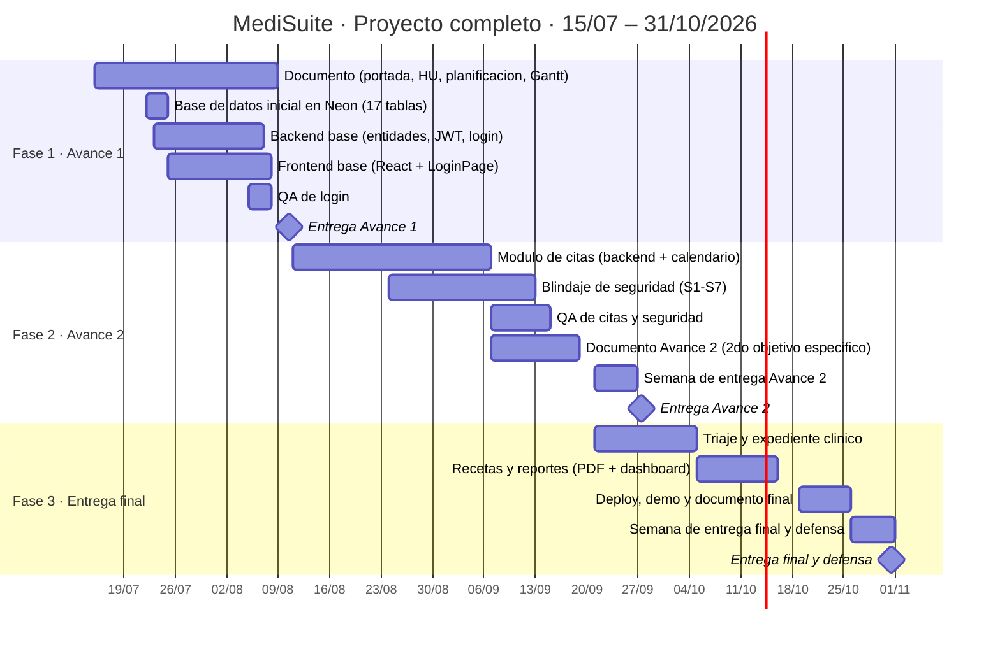

# MediSuite — Avance 1
## Plataforma de Gestión de Citas Médicas Multi-Clínica

**Universidad Evangélica de El Salvador**
**Fecha de entrega:** 10 de agosto de 2026

| Campo | Detalle |
|---|---|
| **Materia** | Programación II |
| **Docente** | Ing. Guevara |
| **Grupo** | 7 |
| **Entrega** | Avance 1 |

---

## 1. Portada

| Nombre completo | CIF | ¿Participó? |
|---|:---:|:---:|
| LOPEZ RUIZ HECTOR NAPOLEON | 2026010132 | SI |
| VIGIL RAMIREZ ALEJANDRO ANTONIO | 2026010204 | SI |
| ORELLANA ROJAS BAYRON ALEXANDER | 2026011707 | SI |
| DIAZ SANTOS ZAIR BENETT | 2026010796 | SI |
| FLORES HERNANDEZ WALTER ALEJANDRO | 2026011012 | SI |
| MELGAR RIVAS WILLIAM ARIEL | 2026011736 | SI |
| MERINO VENTURA ALEJANDRO SEBASTIAN | 2026020122 | SI |
| FUENTES ORTIZ ERIKA ALEXANDRA | 2026011709 | SI |
| VASQUEZ AMAYA WALTER AMILCAR | 2026010068 | SI |
| VENTURA VELASQUEZ CARLOS MARIO | 2026011585 | SI |
| SANCHEZ MENJIVAR NICOLE NOHEMY | 2026010813 | SI |

---

## 2. Objetivo General

Desarrollar una plataforma de gestión de citas médicas multi-empresa (SaaS) que permita optimizar la administración de agendas, el registro de pacientes y el historial clínico en una clínica u hospital, mejorando la eficiencia y calidad de la atención sanitaria mediante control de acceso por roles, digitalización del triaje y trazabilidad del expediente clínico.

---

## 3. Objetivos Específicos

**OE1 (Avance 1):** Diseñar e implementar el módulo de registro y autenticación de usuarios (pacientes, médicos, enfermeras, administradores, recepcionistas) con control de roles y permisos basado en JWT, sobre una arquitectura multi-tenant compatible con la evolución del proyecto a SaaS comercial.

> *En el Avance 2 se agregará OE2 y en la entrega final OE3, acumulando tres objetivos específicos en total.*

---

## 4. Distribución del Equipo (Scrum)

| N° | Nombre completo | Rol Scrum | Rol Técnico |
|----|-----------------|-----------|-------------|
| 1 | LOPEZ RUIZ HECTOR NAPOLEON | PRODUCT OWNER | Analista de Negocio / Project Manager |
| 2 | ORELLANA ROJAS BAYRON ALEXANDER | SCRUM MASTER | Desarrollador Fullstack |
| 3 | VIGIL RAMIREZ ALEJANDRO ANTONIO | DEVELOPER | Desarrollador Backend |
| 4 | DIAZ SANTOS ZAIR BENETT | DEVELOPER | Desarrollador Frontend |
| 5 | FLORES HERNANDEZ WALTER ALEJANDRO | DEVELOPER | Desarrollador Backend |
| 6 | MELGAR RIVAS WILLIAM ARIEL | DEVELOPER | Desarrollador Frontend |
| 7 | MERINO VENTURA ALEJANDRO SEBASTIAN | DEVELOPER | Base de Datos |
| 8 | FUENTES ORTIZ ERIKA ALEXANDRA | QA | Analista de Pruebas |
| 9 | VASQUEZ AMAYA WALTER AMILCAR | QA | Analista de Pruebas |
| 10 | VENTURA VELASQUEZ CARLOS MARIO | ARCHITECT | Arquitecto de Software |
| 11 | SANCHEZ MENJIVAR NICOLE NOHEMY | BUSINESS ANALYST | Analista de Negocio |

**Scrum Master:** Bayron Alexander Orellana Rojas
**Product Owner:** Héctor Napoleón López Ruiz

---

## 5. Definición de Roles y Funciones por Rol del Sistema

Los siguientes son los roles de **usuario dentro del sistema MediSuite** (no los roles Scrum del equipo de desarrollo):

| Rol | Descripción | Funciones en el sistema |
|-----|-------------|-------------------------|
| **Médico** | Profesional de la salud encargado del diagnóstico, tratamiento y seguimiento clínico del paciente. | Ver agenda de citas asignadas · Acceder al expediente clínico · Registrar diagnóstico, recetas y evolución · Modificar o cancelar citas con justificación · Generar reportes de atención |
| **Paciente** | Persona que recibe atención médica. Entidad de datos del sistema gestionada por personal clínico — no tiene acceso directo a la plataforma. | (Entidad de datos gestionada por la enfermera o el recepcionista — sin acceso al sistema) |
| **Enfermera** | Profesional que realiza triaje, toma signos vitales y apoya directamente al médico durante la atención. | Registrar signos vitales (peso, talla, presión, temperatura, frecuencia cardíaca) · Completar datos de pacientes en espera · Clasificar prioridad de atención (triaje) · Consultar agenda y estado de citas |
| **Administrador** | Encargado de la gestión general del sistema, los usuarios y la configuración de la clínica. | Crear, modificar y eliminar usuarios · Configurar horarios y disponibilidad de consultorios · Generar reportes administrativos · Gestionar auditoría de accesos y cambios |
| **Recepcionista** | Personal de recepción que gestiona la entrada y salida de pacientes y el agendamiento de citas. | Registrar pacientes nuevos · Asignar citas según disponibilidad médica · Confirmar asistencia de pacientes · Buscar pacientes por nombre o CIF |

---

## 6. Requerimientos del Sistema (Historias de Usuario)

Las Historias de Usuario siguen el formato Scrum: **"Como [rol], quiero [funcionalidad], para [beneficio]."**

| Prioridad | HU | Historia de Usuario | Criterios de Aceptación |
|-----------|-----|---------------------|--------------------------|
| Alta | **HU-001** | Como **enfermera / recepcionista**, quiero un formulario para registrar pacientes y consultar su expediente, para atenderlos rápidamente. | Paciente registrado con nombre, CIF, fecha de nacimiento y contacto · Búsqueda por nombre o CIF · Expediente muestra historial de citas, diagnósticos y signos vitales |
| Alta | **HU-002** | Como **médico**, quiero registrar una receta electrónica, para llevar el control del tratamiento del paciente. | Receta almacenada en el expediente · Asociada a paciente y médico · Muestra fecha y hora · Incluye medicamentos, dosis y duración del tratamiento |
| Alta | **HU-003** | Como **recepcionista**, quiero agendar una cita para un paciente eligiendo médico y horario disponible, para gestionar la agenda de la clínica sin doble reserva. | Búsqueda de paciente por nombre o CIF · Selección de médico, especialidad, fecha y hora disponible · El sistema impide doble reserva en el mismo bloque horario · Genera código de reserva único (ej. COD-0001) · Registro del motivo de consulta |
| Media | **HU-004** | Como **enfermera**, quiero realizar el triaje de pacientes en espera y registrar sus signos vitales, para que el médico los reciba preparado. | Búsqueda por CIF o nombre · Registro de peso, talla, presión, temperatura, FC y síntomas · Asignación de prioridad (BAJO / MEDIO / ALTO / CRÍTICO) · Datos guardados en el expediente clínico |
| Media | **HU-005** | Como **administrador**, quiero gestionar los horarios de los médicos y la disponibilidad de consultorios, para optimizar la ocupación de la clínica. | Crear, modificar y eliminar bloques horarios · Asignar consultorios a médicos · Visualizar ocupación en tiempo real |
| Alta | **HU-007** | Como **usuario del sistema**, quiero iniciar sesión de forma segura con mi rol y el código de mi clínica, para acceder únicamente a las funciones que me corresponden. | Login con correo electrónico, contraseña y código de clínica · JWT emitido al autenticar · Redirección según rol · Bloqueo tras 5 intentos fallidos en 15 minutos |
| Alta | **HU-008** | Como **administrador de clínica**, quiero crear usuarios del sistema con su rol asignado, para controlar quién accede al sistema. | Alta con nombre, correo, rol (DOCTOR / NURSE / RECEPTIONIST / ADMIN) y clínica · Contraseña temporal asignada · Usuario obligado a cambiar contraseña en el primer inicio de sesión |

> **HU implementada en el Avance 1:** HU-007 — cubre el OE1 "Módulo de autenticación y roles".

---

## 7. Alcances y Limitaciones del Sistema

### 7.1. Qué SÍ hace el sistema (alcance)

- Autenticación segura multi-tenant con JWT y control de roles por clínica.
- Registro y búsqueda de pacientes con expediente clínico básico.
- Gestión de citas médicas (crear, modificar, cancelar) con código de reserva y anti-doble-reserva.
- Triaje digital: registro de signos vitales con clasificación de prioridad.
- Expediente clínico: historial de consultas, diagnósticos, recetas y alergias.
- Dashboard con KPIs para el administrador de la clínica.
- Aislamiento de datos por clínica (arquitectura multi-tenant).
- Interfaz web responsive (desktop, tablet y móvil).

### 7.2. Qué NO hace el sistema (limitaciones)

- **No hay facturación ni pasarela de pago** de servicios médicos.
- **No integra sistemas externos** de laboratorio, farmacia ni aseguradoras.
- **No incluye telemedicina** (videollamadas o consultas remotas).
- **No emite firma electrónica certificada** para recetas.
- **No hay aplicación móvil nativa** (solo web responsive).
- **El paciente no puede modificar su expediente** — solo lectura.
- **No hay módulo financiero ni contabilidad** más allá de conteos operativos.

---

## 8. Planificación (Distribución de Actividades por Avance)

| N° | Actividad | Responsable(s) | Fecha inicio | Fecha fin | Avance |
|----|-----------|---------------|:---:|:---:|:---:|
| 1 | Portada individual (nombre, CIF) | Todos (11) | 15/07 | 20/07 | 1 |
| 2 | Objetivo general | Héctor López | 15/07 | 16/07 | 1 |
| 3 | Objetivo específico OE1 | Héctor López | 15/07 | 16/07 | 1 |
| 4 | Distribución del equipo Scrum | Héctor López | 15/07 | 16/07 | 1 |
| 5 | Roles y funciones del sistema | Nicole Sánchez | 17/07 | 20/07 | 1 |
| 6 | Historias de Usuario (HU) | Nicole Sánchez | 17/07 | 23/07 | 1 |
| 7 | Alcances y límites del sistema | Héctor López | 21/07 | 22/07 | 1 |
| 8 | Planificación (tabla) | Héctor López | 21/07 | 22/07 | 1 |
| 9 | Cronograma Gantt (todo el proyecto) | Héctor López | 21/07 | 22/07 | 1 |
| 10 | Entradas/salidas por HU | Nicole Sánchez | 23/07 | 25/07 | 1 |
| 11 | Declaración de entidades | Carlos Ventura | 23/07 | 25/07 | 1 |
| 12 | Esquema de base de datos en Neon (17 tablas) | Alejandro Merino | 22/07 | 24/07 | 1 |
| 13 | Backend base: Spring Boot, entidades JPA, repositorios | Bayron Orellana / Carlos Ventura / Walter Flores | 23/07 | 04/08 | 1 |
| 14 | Seguridad: Spring Security + JWT + endpoint /login | Alejandro Vigil | 26/07 | 04/08 | 1 |
| 15 | Frontend base: Vite + React + TypeScript + Tailwind | Zair Díaz / William Melgar | 25/07 | 04/08 | 1 |
| 16 | Pantalla de login (LoginPage.tsx) | Zair Díaz / William Melgar | 28/07 | 07/08 | 1 |
| 17 | Casos de prueba QA — módulo de login | Erika Fuentes / Walter Vásquez | 05/08 | 07/08 | 1 |
| 18 | Conclusiones individuales | Todos (11) | 07/08 | 09/08 | 1 |
| 19 | Bibliografía APA | Nicole Sánchez | 07/08 | 09/08 | 1 |
| 20 | Consolidación y PDF del documento | Héctor López | 09/08 | 10/08 | 1 |
| 21 | **Entrega Avance 1** | Héctor López (entrega) | — | **10/08/2026** | 1 |
| 22 | Módulo de citas (backend + calendario) | Equipo backend | 11/08 | 07/09 | 2 |
| 23 | Blindaje de seguridad OWASP (capas 1–7) | Alejandro Vigil + equipo | 24/08 | 13/09 | 2 |
| 24 | QA de citas y seguridad | Erika Fuentes / Walter Vásquez | 07/09 | 15/09 | 2 |
| 25 | **Entrega Avance 2** | Héctor López (entrega) | — | **27/09/2026** | 2 |
| 26 | Triaje, expediente clínico y recetas | Equipo backend + frontend | 21/09 | 16/10 | 3 |
| 27 | Reportes, inventario y dashboard | Equipo backend + frontend | 05/10 | 24/10 | 3 |
| 28 | Deploy, demo y documento final | Todo el equipo | 19/10 | 31/10 | 3 |
| 29 | **Entrega final y defensa** | Todo el equipo | — | **31/10/2026** | 3 |

---

## 9. Cronograma (Diagrama de Gantt)

El diagrama de Gantt cubre **todo el proyecto** desde el 15/07/2026 hasta la entrega final el 31/10/2026, tal como lo indicó el docente.

**Hitos principales:**

| Hito | Fecha |
|------|-------|
| Entrega Avance 1 | 10/08/2026 |
| Entrega Avance 2 | semana del 21–27/09/2026 |
| Entrega Final y Defensa | semana del 26–31/10/2026 |



---

## 10. Entradas y Salidas del Sistema por Historia de Usuario

**HU-001 — Registro y consulta de pacientes**

- **Entradas:** nombre completo, CIF (documento de identidad), fecha de nacimiento, teléfono, dirección, contacto de emergencia, tipo de sangre, alergias conocidas.
- **Salidas:** perfil del paciente registrado con confirmación de guardado, pantalla de expediente con historial de citas y diagnósticos, resultado de búsqueda por nombre o CIF.

---

**HU-002 — Registro de receta electrónica**

- **Entradas:** medicamentos (nombre, dosis, unidad), duración del tratamiento, indicaciones especiales, identificador del médico, identificador del paciente.
- **Salidas:** receta guardada en el expediente, fecha y hora de emisión, lista de recetas del paciente ordenadas cronológicamente.

---

**HU-003 — Agendamiento de cita por recepcionista**

- **Entradas:** búsqueda de paciente (nombre o CIF), médico seleccionado, especialidad, fecha y hora disponible, motivo de consulta.
- **Salidas:** código de reserva único (COD-0001), cita registrada con estado SCHEDULED, actualización de la agenda del médico, confirmación visible en el dashboard de recepción.

---

**HU-004 — Triaje y signos vitales**

- **Entradas:** búsqueda de paciente por CIF o nombre, peso (kg), talla (cm), presión arterial (mmHg), temperatura (°C), frecuencia cardíaca (bpm), síntomas descritos, nivel de prioridad.
- **Salidas:** registro de signos vitales guardado en expediente, paciente clasificado con prioridad (BAJO / MEDIO / ALTO / CRÍTICO), historial de triajes visible por el médico.

---

**HU-007 — Inicio de sesión seguro**

- **Entradas:** código de clínica (slug), correo electrónico, contraseña.
- **Salidas:** token JWT con tiempo de expiración, datos del usuario autenticado (nombre, rol, ID de clínica), redirección a la pantalla correspondiente al rol; en caso de error: mensaje de credenciales inválidas; tras 5 intentos fallidos: bloqueo por 15 minutos.

---

**HU-008 — Alta de usuarios por el administrador**

- **Entradas:** nombre completo, correo electrónico, rol asignado (DOCTOR / NURSE / ADMIN / RECEPTIONIST), clínica asociada.
- **Salidas:** usuario creado y activo en el sistema, contraseña temporal asignada, confirmación de registro al administrador, flag `must_change_password = true` activado.

---

## 11. Declaración de Entidades del Sistema

Las siguientes entidades corresponden a las tablas de la base de datos implementada en Neon PostgreSQL:

| Entidad | Descripción | Atributos principales |
|---------|-------------|----------------------|
| **tenants** | Clínica u organización que usa el sistema (raíz del modelo multi-tenant). | id, slug, commercial_name, legal_name, tax_id, plan, status, max_users, max_patients |
| **users** | Usuario del sistema con credenciales y rol asignado. | id, tenant_id, first_name, last_name, cif, email, password_hash, role, active, failed_login_attempts, locked_until |
| **specialties** | Especialidades médicas disponibles por clínica. | id, tenant_id, name, active |
| **patients** | Información clínica adicional del paciente (extiende users). | id, tenant_id, user_id, birth_date, phone, address, emergency_contact, blood_type, allergies |
| **doctors** | Información profesional del médico (extiende users). | id, tenant_id, user_id, specialty_id, license_number, available_schedule (JSON) |
| **nurses** | Datos de la enfermera (extiende users). | id, tenant_id, user_id, shift, assigned_area |
| **administrators** | Datos del administrador (extiende users). | id, tenant_id, user_id, permission_level |
| **receptionists** | Datos del recepcionista (extiende users). | id, tenant_id, user_id, shift, assigned_office |
| **appointments** | Citas médicas agendadas. | id, tenant_id, patient_id, doctor_id, scheduled_at, status, reason, office, reservation_code |
| **medical_records** | Expediente clínico del paciente. | id, tenant_id, patient_id, general_notes |
| **vital_signs** | Signos vitales registrados en triaje. | id, tenant_id, medical_record_id, weight_kg, height_cm, blood_pressure, temperature_c, heart_rate, symptoms, priority |
| **prescriptions** | Recetas emitidas por el médico. | id, tenant_id, medical_record_id, doctor_id, medications, dosage, duration, instructions |
| **products** | Productos del inventario de la clínica. | id, tenant_id, name, category, unit_of_measure, current_stock, min_stock, unit_price |
| **purchase_orders** | Órdenes de compra a proveedores. | id, tenant_id, supplier, status, total_amount, ordered_on |
| **purchase_order_items** | Líneas de detalle de una orden de compra. | id, tenant_id, purchase_order_id, product_id, quantity, unit_price, received_quantity |
| **physical_assets** | Activos físicos de la clínica (equipos, mobiliario). | id, tenant_id, name, category, acquisition_value, acquired_on, status, location |
| **audit_logs** | Registro de auditoría de acciones críticas. | id, tenant_id, user_id, action, entity_name, entity_id, data_before (JSON), data_after (JSON), ip_address, created_at |

**Total: 17 entidades — implementadas como clases Java (`@Entity`) y tablas PostgreSQL.**

---

## 12. Proyecto Base con la Estructura (Código y Clases)

### 12.1. Paquete principal

```
com.sv.grupo.hospital.citas
```

### 12.2. Estructura de paquetes (backend)

```
backend/src/main/java/com/sv/grupo/hospital/citas/
├── MediSuiteApplication.java
├── config/
│   └── SecurityConfig.java            ← Spring Security + CORS + JWT stateless
├── controller/
│   └── api/
│       └── AuthController.java        ← POST /api/auth/login
├── dao/                               ← 17 repositorios JPA
│   ├── TenantRepository.java
│   ├── UserRepository.java
│   ├── SpecialtyRepository.java
│   ├── PatientRepository.java
│   ├── DoctorRepository.java
│   ├── NurseRepository.java
│   ├── AdministratorRepository.java
│   ├── ReceptionistRepository.java
│   ├── AppointmentRepository.java
│   ├── MedicalRecordRepository.java
│   ├── VitalSignRepository.java
│   ├── PrescriptionRepository.java
│   ├── ProductRepository.java
│   ├── PurchaseOrderRepository.java
│   ├── PurchaseOrderItemRepository.java
│   ├── PhysicalAssetRepository.java
│   └── AuditLogRepository.java
├── dto/
│   └── auth/
│       ├── LoginRequest.java          ← Payload: tenantSlug, email, password
│       └── LoginResponse.java         ← accessToken, tokenType, expiresIn, user
├── exception/
│   ├── GlobalExceptionHandler.java
│   └── ResourceNotFoundException.java
├── model/
│   ├── tenant/
│   │   └── Tenant.java
│   ├── users/
│   │   └── User.java
│   ├── medical/
│   │   ├── Specialty.java
│   │   ├── Patient.java
│   │   ├── Doctor.java
│   │   ├── Nurse.java
│   │   ├── Administrator.java
│   │   ├── Receptionist.java
│   │   ├── Appointment.java
│   │   ├── MedicalRecord.java
│   │   ├── VitalSign.java
│   │   └── Prescription.java
│   ├── inventory/
│   │   ├── Product.java
│   │   ├── PurchaseOrder.java
│   │   ├── PurchaseOrderItem.java
│   │   └── PhysicalAsset.java
│   └── audit/
│       └── AuditLog.java
├── security/
│   └── JwtTokenProvider.java          ← Generación y validación de JWT (JJWT 0.12.6)
└── service/
    └── AuthService.java               ← Lógica: tenant → usuario → BCrypt → JWT
```

### 12.3. Estructura del frontend

```
frontend/src/
├── api/
│   └── auth.ts                        ← loginRequest() → POST /api/auth/login
├── pages/
│   └── LoginPage.tsx                  ← Pantalla de login
├── store/
│   └── authStore.ts                   ← Zustand: token, user, login(), logout()
├── App.tsx
├── main.tsx
└── index.css                          ← Tailwind CSS + tokens de diseño
```

### 12.4. Clases del modelo — ejemplos de implementación

**`Patient.java`**

```java
package com.sv.grupo.hospital.citas.model.medical;

import jakarta.persistence.*;
import lombok.Getter;
import lombok.Setter;
import java.time.LocalDate;

@Entity
@Table(name = "patients")
@Getter
@Setter
public class Patient {

    @Id
    @GeneratedValue(strategy = GenerationType.IDENTITY)
    private Long id;

    @ManyToOne(fetch = FetchType.LAZY)
    @JoinColumn(name = "tenant_id", nullable = false)
    private Tenant tenant;

    @OneToOne
    @JoinColumn(name = "user_id", nullable = false)
    private User user;

    @Column(nullable = false)
    private LocalDate birthDate;

    @Column(length = 20)
    private String phone;

    @Column(length = 200)
    private String address;

    @Column(name = "emergency_contact", length = 100)
    private String emergencyContact;

    @Column(name = "blood_type", length = 5)
    private String bloodType;

    @Column(columnDefinition = "TEXT")
    private String allergies;
}
```

**`Doctor.java`**

```java
package com.sv.grupo.hospital.citas.model.medical;

import jakarta.persistence.*;
import lombok.Getter;
import lombok.Setter;

@Entity
@Table(name = "doctors")
@Getter
@Setter
public class Doctor {

    @Id
    @GeneratedValue(strategy = GenerationType.IDENTITY)
    private Long id;

    @ManyToOne(fetch = FetchType.LAZY)
    @JoinColumn(name = "tenant_id", nullable = false)
    private Tenant tenant;

    @OneToOne
    @JoinColumn(name = "user_id", nullable = false)
    private User user;

    @ManyToOne
    @JoinColumn(name = "specialty_id")
    private Specialty specialty;

    @Column(name = "license_number", nullable = false, unique = true, length = 30)
    private String licenseNumber;

    @Column(name = "available_schedule", columnDefinition = "jsonb")
    private String availableSchedule;
}
```

### 12.5. Tecnologías utilizadas

| Capa | Tecnología | Versión |
|------|-----------|---------|
| Backend | Java | 21 (Temurin LTS) |
| Backend | Spring Boot | 3.3.2 |
| Backend | Spring Security | 6.x |
| Backend | JJWT | 0.12.6 |
| Backend | Hibernate / JPA | 6.5.2 |
| Base de datos | PostgreSQL (Neon) | 16 |
| Frontend | React | 19 |
| Frontend | TypeScript | 6.0 |
| Frontend | Vite | 8.1 |
| Frontend | Tailwind CSS | 3.4 |
| Frontend | Zustand | 5.0 |
| Repositorio | Git / GitHub | — |
| Gestión de tareas | Microsoft Planner | — |

### 12.6. Evidencia del sistema funcionando

Al momento de entrega del Avance 1 el sistema demostró:

- Pantalla de login (`localhost:5173`) con diseño responsive en React + Tailwind CSS.
- Endpoint `POST /api/auth/login` devolviendo token JWT con el payload correcto (`userId`, `tenantId`, `role`).
- Base de datos en Neon PostgreSQL con las 17 tablas del esquema correctamente creadas.
- Log de arranque de Spring Boot: `"Started MediSuiteApplication"` y repositorios JPA inyectados.

---

## 13. Conclusiones

**López Ruiz Héctor Napoleón:**
Coordinar a un equipo de 11 personas en el Avance 1 confirmó que la planificación y la comunicación son tan importantes como el código. Distribuir las 20 actividades del avance en una tabla con responsables y fechas claras permitió que cada integrante supiera exactamente qué hacer y para cuándo, reduciendo la incertidumbre. El diseño de la arquitectura multi-tenant desde el inicio —con el campo `tenant_id` en todas las tablas— fue una decisión técnica que pagó dividendos en los avances siguientes, ya que ninguna entidad tuvo que ser rediseñada para soportar múltiples clínicas.

**Vigil Ramírez Alejandro Antonio:**
La implementación del módulo de autenticación con Spring Security y JWT permitió comprender en profundidad cómo funciona la seguridad en una API REST: el filtro de autenticación intercepta cada request antes de que llegue al controlador, extrae el token del header Authorization y publica el contexto de seguridad para que cualquier capa del sistema lo consulte. La elección de JJWT 0.12.6 y el firmado HS256 con un secreto de 256 bits mínimo fueron decisiones críticas para cerrar la vulnerabilidad OWASP A02 desde el Avance 1.

**Orellana Rojas Bayron Alexander:**
Asumir el rol de Scrum Master en paralelo con tareas de desarrollo backend fue un aprendizaje de gestión de tiempo. La creación de los repositorios JPA con Spring Data —que generan automáticamente las consultas SQL a partir de los nombres de los métodos— demostró cómo un framework bien configurado elimina código repetitivo y permite enfocarse en la lógica de negocio. La convención de un repositorio por entidad facilitó que el resto del equipo encontrara el acceso a datos sin necesidad de buscar en código ajeno.

**Díaz Santos Zair Benett:**
Implementar la pantalla de login con React 19, TypeScript y Tailwind CSS fue el primer contacto real con el stack frontend elegido. La tipificación estricta de TypeScript detectó errores en tiempo de compilación que habrían sido difíciles de rastrear en JavaScript puro, especialmente en el manejo del payload de respuesta del backend. Tailwind CSS demostró ser una herramienta eficiente para construir interfaces responsive sin salir del archivo de componente.

**Flores Hernández Walter Alejandro:**
El trabajo en el backend base durante el Avance 1 permitió comprender la importancia de la arquitectura por capas: cada capa tiene una responsabilidad clara y no debe invadir las responsabilidades de las demás. Las entidades JPA no deben contener lógica de negocio, los repositorios no deben conocer los controladores, y los servicios son el único punto donde vive la lógica de la aplicación. Esta separación facilitó el trabajo paralelo del equipo sin conflictos de integración.

**Melgar Rivas William Ariel:**
La configuración inicial del proyecto frontend con Vite, React y TypeScript demostró cuánto ha evolucionado el tooling de JavaScript: un proyecto completamente configurado —con hot reload, tipado estático y bundling optimizado— está listo en minutos. La integración de Tailwind CSS con el diseño de la pantalla de login evidenció que las clases utilitarias permiten iterar rápidamente sobre el diseño sin cambiar entre archivos de estilos y de componentes.

**Merino Ventura Alejandro Sebastián:**
Diseñar y crear las 17 tablas del esquema de base de datos en Neon PostgreSQL fue la tarea más estratégica del Avance 1. Definir los tipos de datos correctos, las claves foráneas, los índices y las restricciones desde el principio evita migraciones costosas en las fases siguientes. El uso de `TIMESTAMPTZ` (con zona horaria) en lugar de `TIMESTAMP` para las marcas de tiempo fue una decisión importante para un sistema que podría operar en múltiples zonas horarias.

**Fuentes Ortiz Erika Alexandra:**
El diseño de los casos de prueba para el módulo de login en el Avance 1 enseñó que las pruebas no solo verifican el camino feliz (credenciales correctas) sino también los casos de error: credenciales incorrectas, campos vacíos, usuario inactivo y bloqueo por intentos fallidos. Documentar cada caso con los datos de entrada, el resultado esperado y el resultado real permite comparar el comportamiento del sistema antes y después de cada cambio, asegurando que una corrección no rompa funcionalidad existente.

**Vásquez Amaya Walter Amílcar:**
Participar en el QA del módulo de login permitió comprender que las pruebas funcionales son complementarias a las pruebas automáticas: mientras que las pruebas unitarias verifican el comportamiento de componentes aislados, las pruebas manuales verifican la experiencia real del usuario con el sistema completo. La coordinación con el equipo de desarrollo para reportar y reproducir fallos es una habilidad esencial que se practicó en este avance.

**Ventura Velásquez Carlos Mario:**
La declaración de las 17 entidades del sistema desde el Avance 1 estableció el vocabulario del dominio que usaría todo el equipo durante el proyecto. Asegurarse de que cada entidad tuviera atributos bien tipados, nombres en inglés consistentes con el estándar del equipo y relaciones correctamente definidas (OneToOne, ManyToOne, etc.) evitó ambigüedades durante la implementación del backend. La documentación de la tabla de entidades en el documento académico también facilitó la revisión del docente.

**Sánchez Menjívar Nicole Nohemy:**
La redacción de las Historias de Usuario siguiendo el formato Scrum —"Como [rol], quiero [funcionalidad], para [beneficio]"— demostró que una especificación bien redactada elimina la necesidad de múltiples reuniones de aclaración. Los criterios de aceptación definidos para cada HU se convirtieron en la referencia que el equipo de QA usó para diseñar los casos de prueba. Esta alineación entre la especificación, el desarrollo y las pruebas es la esencia de la metodología ágil aplicada en este proyecto.

---

## 14. Bibliografía (APA 7ª edición)

VMware, Inc. (2024). *Spring Boot Reference Documentation* (versión 3.3.2). https://docs.spring.io/spring-boot/docs/3.3.2/reference/html/

VMware, Inc. (2024). *Spring Security Reference Documentation* (versión 6.x). https://docs.spring.io/spring-security/reference/

Neon Technologies, Inc. (2024). *Neon Serverless PostgreSQL Documentation*. https://neon.tech/docs

Meta Open Source. (2024). *React Documentation* (versión 19). https://react.dev/

Vercel. (2024). *Vite Build Tool Documentation* (versión 8.x). https://vitejs.dev/

Tailwind Labs. (2024). *Tailwind CSS Documentation* (versión 3.4). https://tailwindcss.com/docs

pmndrs. (2024). *Zustand — State management for React*. https://github.com/pmndrs/zustand

Bloch, J. (2018). *Effective Java* (3.ª ed.). Addison-Wesley.

Walls, C. (2019). *Spring in Action* (5.ª ed.). Manning Publications.

Schwaber, K., & Sutherland, J. (2020). *The Scrum Guide*. Scrum.org. https://scrumguides.org

PostgreSQL Global Development Group. (2024). *PostgreSQL 16 documentation*. https://www.postgresql.org/docs/16/

---

*Documento preparado por: Héctor Napoleón López Ruiz — Versión 1.0 · 10/08/2026*
