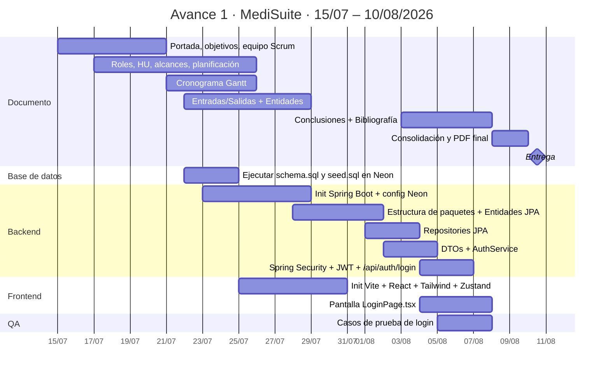

# Cronograma Gantt — Avance 1 · MediSuite

> **Cómo usar este archivo (Tarea 9.1):** abre esta página en GitHub con tu navegador —
> https://github.com/NapoSV/medisuite/blob/main/docs/diagramas/gantt_avance1.md —
> y GitHub dibuja el diagrama automáticamente (no necesitas instalar ni pagar nada).
> Luego toma una captura con `Win + Shift + S` y pégala en el Word del equipo,
> sección "Cronograma Gantt".
>
> El Gantt **oficial** vive en Microsoft Planner del equipo; esta versión es el
> respaldo académico para el documento.
>
> **⚠️ Actualización 27/07/2026:** el ingeniero aclaró que el Gantt del documento
> debe cubrir **todo el proyecto** (hasta la entrega final). Para la sección 9 del
> Word usa ahora [`gantt_proyecto_completo.md`](gantt_proyecto_completo.md);
> este archivo queda como detalle interno del Avance 1.

