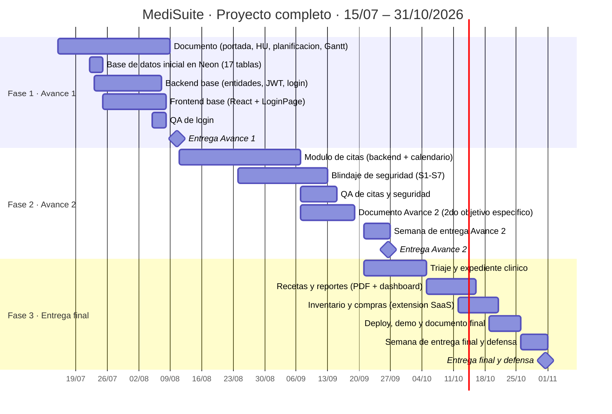

# Cronograma Gantt — Proyecto completo · MediSuite

> **Este es el Gantt que va en el documento entregable (sección 9).**
> Aclaración del ingeniero (27/07/2026): el Gantt y la planificación deben cubrir
> **todo el proyecto hasta la entrega final**, no solo el Avance 1. Las fases
> futuras pueden representarse con tareas genéricas.
>
> **Cómo usarlo:** abre esta página en GitHub con tu navegador —
> https://github.com/NapoSV/medisuite/blob/main/docs/diagramas/gantt_proyecto_completo.md —
> GitHub dibuja el diagrama automáticamente. Toma una captura con `Win + Shift + S`
> y pégala en el Word del equipo, sección "Cronograma Gantt".
>
> El Gantt **oficial** vive en Microsoft Planner del equipo; esta versión es el
> respaldo académico. El detalle día-a-día del Avance 1 está en
> [`gantt_avance1.md`](gantt_avance1.md); el plan completo de las fases 2 y 3 en
> [`../PLAN_FASES_2_3.md`](../PLAN_FASES_2_3.md).

**Hitos académicos:**

| Hito | Fecha |
|---|---|
| Entrega Avance 1 | 10/08/2026 |
| Entrega Avance 2 | semana del 21 al 26/09/2026 |
| Entrega final y defensa | semana del 26 al 31/10/2026 |

